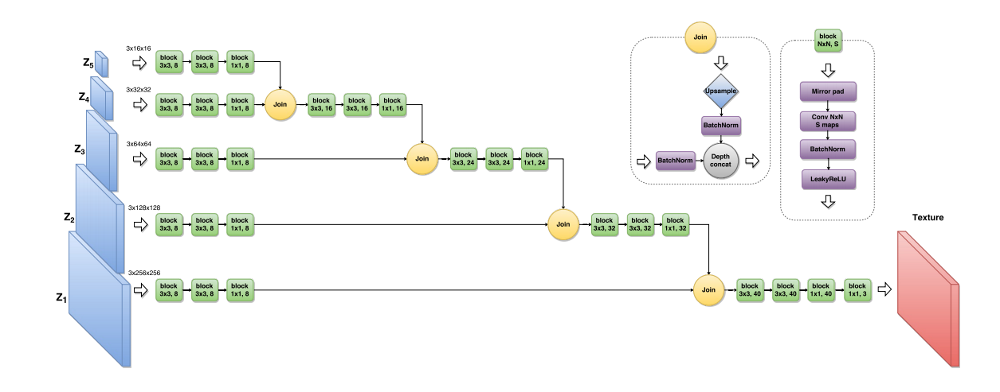
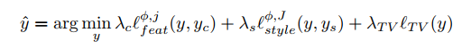
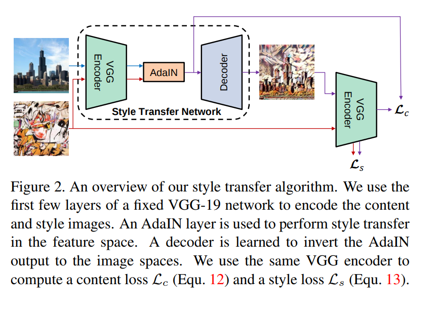

# neural style transfer 总结

三个阶段：

* 迭代优化
* feedforward ，但是 一个网络只能代表一个 style
* feedforward，一个网络，任意 style


## Image Style Transfer Using Convolutional Neural Networks (2016) CVPR 

* 迭代优化


**如何描述 image 的 content**

* 神经网络中间层的 feature map

```python
x : [num_channel, height, width]
```


**如何描述 image 的 style**

* 神经网络中间层的 feature map 做些操作
* style 不需要位置信息，操作需要 消除掉位置信息。

```python
x : [num_channel, height, width] 

x = x.view(num_channel, -1)
style = torch.matmul(x, x.transpose(0,1))
```


**loss**

```python
# content loss
c_loss = torch.mean((content_pred - content_target)**2)
# style loss
s_loss = torch.mean((style_pred-style_target)**2)
```


**总 loss**

- `content_loss + style_loss`


**流程：**

* 将 style-image输入神经网络，计算 style_target
* 将 content-image 输入神经网络，计算 content_target
* 随机噪声输入网络，计算 content_loss 和 style_loss 不停优化 随机噪声


## Texture Networks: Feed-forward Synthesis of Textures and Stylized Images (2016) ICML

* 一个网络，一个 style， `feed-forward` 的方式 进行 style-transfer





**使用GAN架构**

* `D` : 预训练的 `CNN` ，不更新！！


**做 texture synthesis 时不用 content loss**

**做 style transfer 时候，用 content loss**


## Perceptual Losses for Real-Time Style Transfer and Super-Resolution (2016) ECCV

* 一个网络，一个 style

**没有用 GAN， 直接训练出一个 transfer 网络**


**loss 函数**




## Arbitrary Style Transfer in Real-time with Adaptive Instance Normalization (2017) ICCV

* feed-forward 

**能够表示 style 不仅仅是 gram 矩阵，还可以是 feature map 的均值和方差。。。。**

**通过改变 feature map 的均值和方差，也可以改变 style**





## 疑问？

* 为什么 style 那么表示是可行的？
* style transfer 貌似都没有用 bn。

