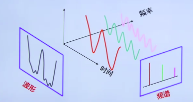
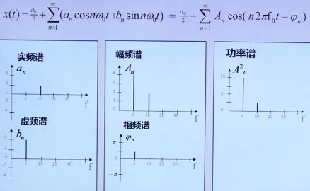
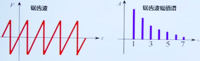

* A/D 变换，模数转换，模拟信号到数字信号（电信号到数字信号）
* D/A 变换，数模转换，数字信号到模拟信号
* 采样定理：
  * 采样：将连续的传感器模拟信号，通过 A/D 转换，转化成能够分析的离散的数字量
  * 采样密度：每个周期应该采几个点
    * 为保证采样后的信号能够真实的保留原始模拟信号的信息，信号的采样频率必须至少为原信号中最高频率成分的2倍，（ie：**一个周期内，至少要采两个点，因为要保证最基本的周期信息**）。
    * 在工程领域，为保证采样信号的质量，一般是要大于 5 倍。

**频率混叠**


* 采样是时域乘积，等价于频域卷积，脉冲信号的卷积就是搬移，在频谱脉冲足够宽的情况下，卷积的搬移能够正确的搬移，如果频谱脉冲比较窄，那么搬移的过程中就会重叠。


```matlab
% A/D  变换
Fs=11025; %采样频率
N=44100;  % 采样长度，4s
t=[0:N-1]/N;
x=waverecord(N,Fs);
plot(t, x);
set(gca, 'color', [.95, .95, .95]);
```


```matlab
Fs=44100; %表示此离散数据的采样频率，注意，采样频率和真实数据的频率不是同一个东西
dt=1.0/Fs; %采样间隔, 采样频率的倒数
T=2; % 生成两秒数据
N=T/dt; % 采样点
t=[0:N-1]/N;
x=.3*sin(2*pi*600*t);
plot(t, x);
axis([0, .01, -.5, .5]);
wavplay(x, Fs);
set(gca, 'color', [.95, .95, .95]);
```


## matlab基础

```matlab
x=linspace(0, 4*pi, 100); % 0~4pi 平均取100个点
y=sin(x);
plot(x, y);

% 2-D
x=-8:.5:8;
y=x;
[X,Y]=meshgrid(x,y);
R=sqrt(x.^2 + Y.^2)+eps;
z=sin(R)./R;
mesh(z);

% 显示
plot(x, y)
stem(x, y)
hold on; %后面曲线叠加到前面的曲线上

subplot(2,2,1); plot(x,y);
subplot(2,2,2); plot(x,y);
```

**变量**

* 所有变量默认是双精度变量
* 所有变量默认为矩阵，一个值就是一个 1*1的矩阵
* `==`， `~=` , `&`, `|`
* `*` 矩阵相乘，`.*` 点乘


## 信号函数 与 标准信号

* 信号发生器： **数字信号 --D/A--> 模拟电信号**
  * 正弦波，方波，三角波，锯齿波，白噪声，脉冲信号，阶跃信号，斜坡信号，加速度信号

$$
y(t)=Asin(2\pi ft + \phi)
$$

* $f$ : 正弦波的频率
* $\phi$ : 正弦波的初始相位


**正弦波的离散采样公式**
$$
y(n\Delta t)=Asin(2\pi f n\Delta t + \phi)
$$

* $Fs=\frac{1}{\Delta t}$ : **采样频率**，（和正弦波的频率不是一个 东西） 
* $n=0,1,2,3,...,N$


**方波**
$$
y(t)
\begin{cases}
=A, & -\frac{T}{2}\lt t \le0 \\
=-A, & 0\lt t \le \frac{T}{2}
\end{cases}
$$

* `square(2*pi*fs*t)`


**白噪声**

* `randn(1, n)`

**均匀噪声**

* `rand(1, n)`


## 时域分析

> * 信号波形参数识别
> * 信号的数字微分和数字积分算法


**信号波形参数识别**

* 需要测量的参数有：周期，频率，峰值/双峰值，初相位，均值，均方值（平方的均值），方差
* 均值：反应信号变化的中心趋势，也称以为 直流分量
* 方差：反应信号绕均值的波动程度
* 均方值：信号求平方然后求和，然后取平均。表示信号强度。也是能量的一种表达


**周期/频率，相位的 过零点检测法**

* 两个过零点的时间差就是周期（都是上升沿或者都是下降沿）
* 第一个过零点位置和与周期的比例可算出初相位


**信号的数字微分和数字积分算法**

* 数字微分法（中值法）
  * $n$ 表示第 n 个采样点
  * $\Delta t$ 表示采样间隔

$$
x(n) \approx \frac{x(n+1)-x(n-1)}{2\Delta t}
$$

* 数字积分法（梯形法）

$$
y(n)=y(n-1)+\Delta t *\Bigr[x(n)+x(n-1)\Bigr] / 2
$$


**图像边缘检测**

* 使用二维数字微分，对于离散的值来说，微分符号就变成了微分算子, 下面是用来检测垂直边缘的算子。

$$
sobel=
\begin{matrix}
-1 & 0 & 1 \\
-2 & 0 & 2 \\
-1 & 0 & 1
\end{matrix}
$$

```matlab
vid=videoinput('winvideo', 1, 'YUY2_640*480');
set(vid, 'ReturnedColorSpace', 'rgb');
preview(vid);
pause;
start(vid);
for(i=1:10)
  getpic=getsnapshot(vid);
  filename=int2str(i);
  filename=[filename, '.jpg'];
  imwrite(getpic,filename);
  pause(0.5);
 end
 
 stop(vid);
 closepreview(vid);
 delete(vid);
 clear;
```


# 信号的频谱分析

> 谱：最早在光学领域提出，当一束白光经过三棱镜，会按照光的波长，分解成赤橙黄绿青蓝紫等色彩，称之为光谱。波长是x轴，幅值是y轴。
>
> 频谱：将时间信号分解成 各种频率 正弦波/余弦波 的和

**频谱分析的优点**

* 用于复杂信号分析
* 抗干扰能力强
* 有很明确的物理意义





>  信号
>
>  * 周期信号
>  * 非周期信号


## 周期信号

> 包含： 连续信号，离散信号，主要工具就是傅立叶级数。
>
> * 在数字信号领域，因为用到了 信号截断，不管原信号是不是周期信号，都会被转成周期信号。
> * 所以在数字信号领域，只需要考虑周期信号这部分知识就可以了。

$$
x(t)=x(t+nT)
$$

* $T$ 为信号的周期
* $F=\frac{1}{T}$ ：称之为信号的频率 


> 正交向量的定义：inner-product 为0
>
> 正交**函数**的定义（类比正交向量的定义）：
>
> * 不同函数  **相乘 然后 积分** 为0
> * 相同函数 **相乘 然后 积分** 为 1
> * 三角函数集满足此要求 $sin(2\pi nf_0t), n=1,2,3...$, 
>
> $$
> \begin{cases}
> \int_a^bf(x)g(x)dx = 0 \\
> \int f(x)f(x) dx=1 
> \end{cases}
> $$
>


* 三角函数分解与合成

$$
\begin{align}
x(t)&=\frac{a_0}{2}+\sum_{n=1}^\infty \Bigr(a_ncos(2\pi nf_0t)+b_nsin(2\pi nf_0t)\Bigr)\\
其中（以下是傅立叶级数）：\\
a_0&=\frac{2}{T}\int_{t_0}^{t_0+T} x(t)dt \\
a_n&=\frac{2}{T}\int_{t_0}^{t_0+T} x(t)cos(2\pi nf_0t)dt, n=1,2,3... \\
b_n&=\frac{2}{T}\int_{t_0}^{t_0+T} x(t)sin(2\pi nf_0t)dt, n=1,2,3...
\end{align}
$$

> $a_n, b_n$ ： 即原信号在该对应频率上的 **投影 ** （类比矩阵投影）
>
> $n$ 是整数：表示当前频率是 **几倍的 基频**
>
> $a_0$ : 就是在直流分量上的投影
>
> $T$ : 时域信号的周期，可以看出，傅立叶级数的计算仅仅基于一个周期
>
> 疑问：
>
> * 为什么 乘 2/T
> * $f_0$ ：基频，和**时域信号的周期相关， $f_0=\frac{1}{T}$**， 意思是，此信号的各个频率分量不可能小于 $f_0$


**频谱图：使用图形表示 各频率成分的能量大小情况**



* 实频谱： $n->a_n$
* 虚频谱： $n->b_n$
* 幅频谱：$n->A_n$
* 相频谱：$n->\varphi_n$
* 功率谱：$n->A^2_n$  （常用）


> **周期信号频谱的特点**
>
> * 离散性：每条谱线代表一个频率分量
> * 谐波性：谱线出现在 整数倍的 基频上（不可能出现在 1.5 $f_0$ 上？？？ 为什么）
> * 收敛性：谐波次数越高，谐波分量越小




> 使用快速傅立叶变换（FFT） 计算频谱
>
> * 对于 A/D 变换采样后的数字信号，连续值变成离散值，需要用数字积分法求出傅立叶级数，这就是离散傅立叶变换


**数字信号的频谱计算方法**

* 信号的截断：
  * 计算机不可能对无限长的信号进行测量和运算，而是取有限的时间片段进行分析，这个过程称之为信号截断
  * 为方便数学处理，对截断信号做周期延拓，得到 **虚拟** 的无限长信号。
  * 考虑在 FFT 的时候，对于傅立叶级数的计算仅仅是定义在 **无限长信号的** 一个周期内的。所以我们只需要对截断的信号做 **概念上的 周期延拓** 就好，不会影响到傅立叶级数的计算。这个会造成影响的就是傅立叶逆变换的时候了。逆变换后得到的是周期延拓后的信号。 


> 离散傅立叶变换：DFT，适应计算机做傅立叶变换而引出的一个专有名词
>
> * 对信号进行 截断，然后周期延拓(概念上的，并不是实际情况下的)，得到周期信号
> * 转变成周期信号的 傅立叶级数分解，使用数字积分法计算傅立叶级数


**离散傅立叶变换（离散周期信号）**

* 将一个 复数 序列 $\{{\mathbb x_n}\}:=x_0,x_1,x_2,...,x_{N-1}$ 转换成另一个复数序列 $\{\mathbf X_k\}:=X_0, ..., X_{N-1}$ 
  * 如果是连续信号的采样的话，序列为**采样序列** , $x_n$ 表示采样点的值
* 用在
  * 使用计算机计算 **连续周期信号的 傅立叶级数**：需要采样，取其中一个周期，然后算
  * 使用计算机计算 **连续 非周期 信号的傅立叶级数**： 需要采样，截断（当作一个周期），然后算
  * 使用计算机计算 图像的 傅立叶级数：图像本身就是离散 截断过的信号。


$$
a_n=\frac{2}{T}\int_{t_0}^{t_0+T} x(t)cos(2\pi nf_0t)dt, n=1,2,3... 
$$

* 上面是 连续的情况下 傅立叶系数的 计算公式，但是计算机无法求解这个公式。在计算机的世界里：
  * 对**一个周期的信号进行 采样**(A/D变换)，得到一个数值序列 $\{\mathbf x_k\}:=x_0, x_1, x_2, ..,x_{K-1}$
  * 使用求和估计积分

$$
a_n=\sum_{k=0}^{K-1} x_k cos(2\pi nf_0x_k)
$$


**截断窗函数的作用**：控制能量泄露 和 栅栏 效应。


##  非周期信号的频谱分析

> 在数字信号领域一般不用。主要工具是傅立叶积分（周期信号的工具是傅立叶级数）


# 信号的数字滤波技术


# 参考资料

[https://www.dsprelated.com/freebooks/mdft/Relation_DFT_Fourier_Series.html](https://www.dsprelated.com/freebooks/mdft/Relation_DFT_Fourier_Series.html)

