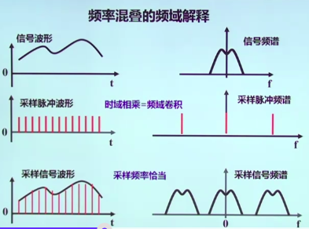

* A/D 变换，模数转换，模拟信号到数字信号（电信号到数字信号）
* D/A 变换，数模转换，数字信号到模拟信号
* 采样定理：
  * 采样：将连续的传感器模拟信号，通过 A/D 转换，转化成能够分析的离散的数字量
  * 采样密度：每个周期应该采几个点
    * 为保证采样后的信号能够真实的保留原始模拟信号的信息，信号的采样频率必须至少为原信号中最高频率成分的2倍，（ie：**一个周期内，至少要采两个点，因为要保证最基本的周期信息**）。
    * 在工程领域，为保证采样信号的质量，一般是要大于 5 倍。

**频率混叠**



* 采样是时域乘积，等价于频域卷积，脉冲信号的卷积就是搬移，在频谱脉冲足够宽的情况下，卷积的搬移能够正确的搬移，如果频谱脉冲比较窄，那么搬移的过程中就会重叠。


```matlab
% A/D  变换
Fs=11025; %采样频率
N=44100;  % 采样长度，4s
t=[0:N-1]/N;
x=waverecord(N,Fs);
plot(t, x);
set(gca, 'color', [.95, .95, .95]);
```


```matlab
Fs=44100; %表示此离散数据的采样频率，注意，采样频率和真实数据的频率不是同一个东西
dt=1.0/Fs; %采样间隔, 采样频率的倒数
T=2; % 生成两秒数据
N=T/dt; % 采样点
t=[0:N-1]/N;
x=.3*sin(2*pi*600*t);
plot(t, x);
axis([0, .01, -.5, .5]);
wavplay(x, Fs);
set(gca, 'color', [.95, .95, .95]);
```


## matlab基础

```matlab
x=linspace(0, 4*pi, 100); % 0~4pi 平均取100个点
y=sin(x);
plot(x, y);

% 2-D
x=-8:.5:8;
y=x;
[X,Y]=meshgrid(x,y);
R=sqrt(x.^2 + Y.^2)+eps;
z=sin(R)./R;
mesh(z);

% 显示
plot(x, y)
stem(x, y)
hold on; %后面曲线叠加到前面的曲线上
```

**变量**

* 所有变量默认是双精度变量
* 所有变量默认为矩阵，一个值就是一个 1*1的矩阵
* `==`， `~=` , `&`, `|`