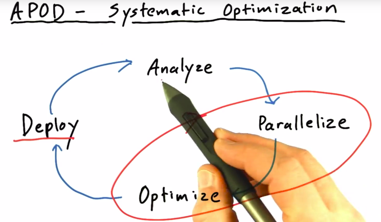
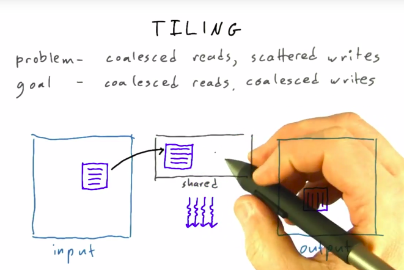
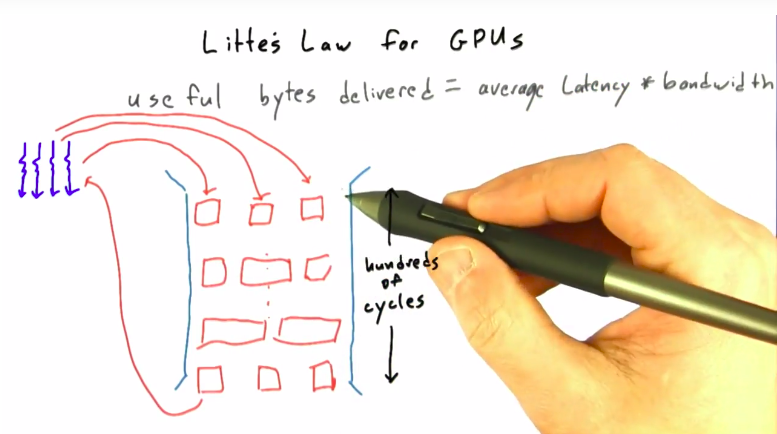

# Optimizing GPU Programs

**想要编写一个高效的GPU程序需要注意的几件事**

* **coalesce global memory accesses, **
  * 读写都要注意内存的连续
  * 因为每次访存都是以 chunk 的形式来的。
* **avoid thread divergence, **
  * (减少线程中的跳转操作。)
* **decrease time spent on memory operations**
  * 降低在内存访问上所消耗的时间
    * 可以将经常访问的数据移动到 shared-memory 上来实现

**arithmetic intensity**
$$
 = \frac{math}{memory}
$$

* math per memory， 每个 memory 读出来后，计算了多少次
* 越大越好

**优化的级别**

* 选择一个好的算法 
  * 选择一个 fundamentally parallel 的算法
* 遵循基本的 GPU 编程原则
  * coalescing **global** memory： 相邻的线程应该读写相邻的 global memory 区域
    * 对于 global memory 的原则。其它不用考虑
    * 目标是实现，coalesced **reads**, coalesced **writes**
  * use shared memory
* 架构级别上的优化
  * bank conflicts
  * optimizing register
* $\mu$-optimization at instruction level 
  * floating point
  * denorm hacks

## 代码优流程

**代码优化流程：APOD**

* **Analyze**: Profile whole application 
  * where can it benefit
  * by how much?
* **Parallelize: ** 
  * Pick an approach
    * 找个好的 libraries
    * Programming Language
  * Pick an algorithm
    * 这个非常重要
* **Optimize**
  * profile-driven optimization
  * Don't optimize in a vacuum
  * 在真实环境中测试！！！！
* **Deploy**

**Weak vs Strong Scaling**

> Serial program solves problem size P in time T
>
> ex: fold a protein in an hour

* weak scaling: run a larger problem (or more)
  * fold a **bigger** protein, or more small ones
  * solution size varies with fixed problem size per core
* Strong Scaling: run a problem faster
  * fold the same protein **in a minute**
  * solution size varies with fixed total problem size

**在 analyze 过程需要了解什么**

* understanding hot-spots
  * don't rely on intuition
  * 执行 profiler，他会告诉你每个函数占用的时间的。
  * 并行机制带来的加速 **受限于** 被并行部分在程序中所占用的比例。

$$
\max speedup = \frac{1}{1-p}
$$

* understanding **strong scaling** VS **weak scaling**

**Parallelize 应该注意的**

* 最大化的并行并不一定带来最优的结果。granularity coarsening
* memory： 花费在 读写 内存的时间。
  * 如果能达到 40-60% 的最大带宽，okey
  * 60-75% 的最大带宽，good
  * \> 75% 的最大带宽， excellent
  * 永远不会达到最高带宽。
* compute：花费在 计算 读进来的数据的时间。

**deviceQuery**

* GPU clock rate:  （.9GHz）GPU 的计算速度
* Memory clock rate：（2500MHz） 内存的速度
* Memory bus width： （128-bit），每次 clock cycle，内存中有多少 bit 被转移。

**带宽（band width）**

> GB/s, 每秒传送多少数据

* 理论最高带宽的计算：memory clock rate * memory bus width
* 真实带宽的计算： 这段代码的数据 transfer 的数量 / 代码执行的时间。
  * 计算数据 transfer 数量的时候不要忘记 不仅考虑读，也要考虑写哦。

## 一个 Demo

一个矩阵 transpose 的代码，如果每个点一个线程的话，会导致

* coalesced reads, scattered writes

问题，为了遵循 coalesced global memory access 原则，应该怎么改呢？

* 一个 thread-block 处理一个 tile
* ​

**Little's LAW**

> how to utilize all memory bandwidth
>
> Little's LAW:  **useful of bytes delivered = average latency of each transaction * bandwidth**

* 将 memory 机制看作一个 pipe， pipe是 **又长又宽** 
* **长** 是因为，需要多个 clock cycle 才能将数据读出来
* **宽** 允许同一时间可以处理多个 **线程** 的请求。

**对于 memory ，我们能怎么 干呢？**

* 让 内存的 pipe 变得 **更宽**。

