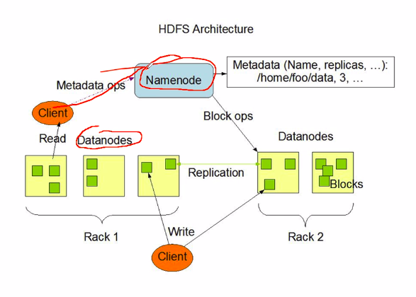
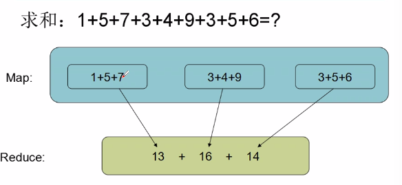

# hadoop 的基本概念，伪分布式 hadoop 集群安装， hdfs， mapreduce 演示

* hdfs 的原理和使用操作，编程
* mapreduce 的原理和编程
* 常见 mr算法实现和 shuffle 的机制
* hadoop2.x中 HA 机制的原理和全分布式集群安装部署及维护
* hbase hive
* storm+kafka
* 实战项目

**之前： HDFS + map-reduce 是 hadoop**

**是什么**

* 解决问题
  * 海量数据的存储（HDFS）
  * 海量数据的分析（MapReduce, Spark, Storm）
  * 资源管理调度（YARN）**分发 jar 包，分配节点资源。**
* **（手动写分布式程序太复杂了。）**
* **运算逻辑分发**  到 **分布式存储系统** 上解决

**狭义hadoop能做什么**

* 海量  离线 日志分析 。
* 处理的都是文本文件。

## 如何解决海量数据的存储问题

* 考虑负载均衡
* 备份安全性

**HDFS**

* Datanode： 数据节点
* 将一个大文件（10G）分割成多个小块 （128M），分发到不同的 Datanode 中。每个小块，在分布式上有多个副本。
  * 可以使得负载均衡，一个文件分成了多个块，不同的块在不同的机器上。
  * 每个块有多个副本，可以解决某台机器坏掉的问题
* 客户端访问数据 只会指定 文件路径名，但是客户端不会知道这个文件到底是怎么存储的
* **Namenode**： 保存 文件路径名和实际存储之间的映射。

**如何解决海量计算问题（计算逻辑分发到数据所在的地方去。）**

* 数据被打散了，放到了不同的机器上，如果对数据进行处理，应该怎么办呢？
* 将计算逻辑分发到数据所在的地方去
  * 但是每个 datanode 只知道这个文件的部分数据，全局的都不知道
* 所以 MapReduce 将处理过程分为两个阶段
  * Map 阶段：处理局部数据，各个 datanode 并发运行。
  * Reduce 阶段：只在一台机器上运行，将 Map 产生的结果通过网络汇集到这个节点上然后进行再处理。
  * ​

