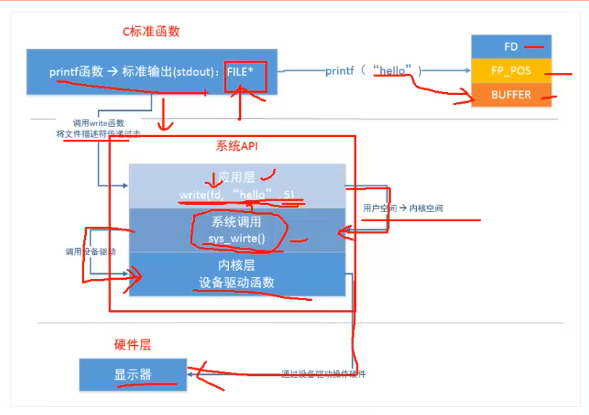

# C 文件操作 API 总结




## 什么是文件

一个文件（file）通常是磁盘上的一段命名存储区。`C` 将文件看成是连续的字节序列，其中每一个字节都可以单独的读取。

ANSI C 提供了文件的两种视图：

* 文本视图：**程序看到内容与文件的内容有可能不同**
* 二进制视图：**文件中的每个字节都可以为程序所访问**


## 文件操作

### 一、 读文件

[http://www.cplusplus.com/reference/cstdio/fopen/](http://www.cplusplus.com/reference/cstdio/fopen/)

```c++
FILE * fopen ( const char * filename, const char * mode ); // <stdio.h>, <cstdio> 
```

* 打开文件， 名字为 `filename`, 模式为 `mode`
* `mode` : `r, w, a`， `r+, w+, a+`, `rb, wb, ab`, `rb+, wb+, ab+` 对于 `unix` 来说，加不加 `b` 是一样的 


**FILE结构体中的内容**

* 文件描述符: int 值, PCB 中有个文件描述符表
* 文件读写指针: 当前访问位置
* `I/O` 缓冲区: 减少对硬盘操作的次数


### 二、 关闭文件

[http://www.cplusplus.com/reference/cstdio/fclose/](http://www.cplusplus.com/reference/cstdio/fclose/)

```c
int fclose ( FILE * stream );
```

* 关闭文件， stream 是 open 是返回的指针， 如果关闭成功返回0, 否则，返回 EOF。可以通过是否返回 0 来判断是否关闭成功。

### 三、读写文件

* `getc()` --- `putc()`
* `fgets()` --- `fputs()`

[http://www.cplusplus.com/reference/cstdio/getc/?kw=getc](http://www.cplusplus.com/reference/cstdio/getc/?kw=getc)

[http://www.cplusplus.com/reference/cstdio/putc/?kw=putc](http://www.cplusplus.com/reference/cstdio/putc/?kw=putc)

```c
int getc ( FILE * stream ); // 从 stream 中 取出一个 char， 如果到达文件结尾， 会返回 EOF
int putc ( int character, FILE * stream ); // 像 stream 中写入一个 char， 位置由 stream 的内部指针决定。
```


[http://www.cplusplus.com/reference/cstdio/fgets/?kw=fgets](http://www.cplusplus.com/reference/cstdio/fgets/?kw=fgets)

[http://www.cplusplus.com/reference/cstdio/fputs/](http://www.cplusplus.com/reference/cstdio/fputs/)

```c
char * fgets ( char * str, int num, FILE * stream );// 不会丢掉换行符，会向末尾加一个 空字符构成字符串
int fputs ( const char * str, FILE * stream ); // 不会添加换行符，

fflush(); // 刷新到文件中
```


### 四、任意位置操作文件

* fseek
* ftell

[http://www.cplusplus.com/reference/cstdio/fseek/?kw=fseek](http://www.cplusplus.com/reference/cstdio/fseek/?kw=fseek)

`FILE` 对象中 有个属性(position indicator)是 记录着当前要访问的 位置。`fseek` 就是用来操作这个属性的。

`getc` 时， 会返回当前位置的 char， 然后 position indicator 加一。

```c
int fseek ( FILE * stream, long int offset, int origin );
```

* 设置 position indicator
* offset : 可正可负
* origin ： `SEEK_SET `(文件的开头) , `SEEK_CUR`( 当前位置), `SEEK_END`（文件结尾）

[http://www.cplusplus.com/reference/cstdio/ftell/](http://www.cplusplus.com/reference/cstdio/ftell/)

```c
long int ftell ( FILE * stream ); // 获取当前位置
```


# Linux 系统调用

* 看man文档
  * `man 2 open`

```c++
#include <sys/types.h>
#include <sys/stat.h>
#include <fcntl.h>

// 返回的是文件描述符
int open(const char* pathname, int flags);
// mode: 666 777 这样的
int open(const char* pathname, int flags, mode_t mode);
int create(const char* pathname, mode_t mode)
```

* `errno`
  * `/usr/include/errno.h` 文件夹下


**open 函数的使用**

```c++
#include <sys/types.h>
#include <sys/stat.h>
#include <fcntl.h>

#include <unistd>

int main(){
  int fd;
  // 打开文件
  fd = open("filename.txt");
  if (fd==-1){
    // 打印错误信息, openfile: 错误信息
    perror("openfile: ");
    exit(1);
  }
  int ret = close(fd);
  
  
  // 创建文件, mode为 8进制数, 本地有个掩码, 需要和本地掩码的反做一个按位与操作
  // 本地掩码: umask 命令可以输出, umask newmask
  fd = open("filename2.txt", O_RDWR|O_CREAT, 0777);
}
```


## 参考资料

C Primer Plus

