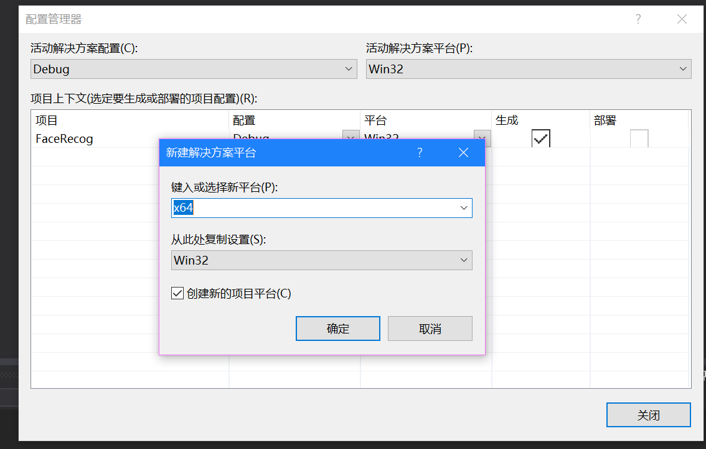

# vs2013 opencv2.4.13配置

 ## 电脑环境变量配置

1. OPENCV_DIR  --> opencv\build\installx64\vc12
2. Path --> 添加 %OPENCV_DIR%\bin


## vs2013 属性管理配置

1. 创建新项目

2. 新建解决方案平台 X64
  

3. 打开，属性管理器界面，右击 "Debug | 64" 文件夹，然后点击 "添加新项目属性表"

4. 随意指定属性表的名字，然后添加

5. 右击 **新创建的属性表**，然后选择属性

6. 配置 **包含目录**（常规属性->VC++目录->包含目录）,添加 **$(OPENCV2_DIR)\..\\..\include\opencv** **$(OPENCV2_DIR)\..\\..\include\opencv2**   **$(OPENCV2_DIR)\..\\..\include\ **

7. 配置 **附加包含目录** (常规属性->C/C++->附加包含目录)，添加 **$(OPENCV_DIR)\..\..\include**.

8. 配置 **附加库目录**（常规属性->链接器->常规->附加库目录），添加**$(OPENCV_DIR)\lib**

9. 指定 **附加依赖项** （常规属性-> 链接器-> 输入 -> 附加依赖项），将 %OPENCV_DIR%\lib下的**所有带有 d字母的 .lib**文件名添加上去。如果是配置 "Release"的话，就把所有不带d字母的文件名拷贝上去


```
opencv_calib3d2413d.lib
opencv_contrib2413d.lib
opencv_core2413d.lib
opencv_features2d2413d.lib
opencv_flann2413d.lib
opencv_gpu2413d.lib
opencv_highgui2413d.lib
opencv_imgproc2413d.lib
opencv_legacy2413d.lib
opencv_ml2413d.lib
opencv_nonfree2413d.lib
opencv_objdetect2413d.lib
opencv_ocl2413d.lib
opencv_photo2413d.lib
opencv_stitching2413d.lib
opencv_superres2413d.lib
opencv_ts2413d.lib
opencv_video2413d.lib
opencv_videostab2413d.lib
```

