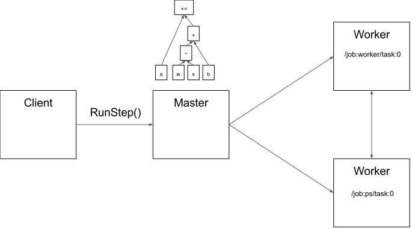

# tensorflow 结构

## Overview

`Tensorflow` 在运行时，是一个跨平台的库。图一 展示了它的一般架构。`C API` 将用户级别的代码和运行时的核心代码分开。

图一：

**这篇文档主要关注于以下几层：**

* **Client:**
  * 定义计算图
  * 使用 `session` 初始化图的执行
* **Distributed master:**
  * 通过 `Session.run()` 的参数，从图中删掉特定的子图，
  * 将子图划分成多个片段，放到不同的进程和设备上执行。
  * 把图片段分发给 `worker services` 。
  * 通过 `worker services` 初始化图的片段的执行。
* **Worker Services** (one for each task)
  * 将图的 `op`的执行 合适的调度到可获得的硬件上（CPUs，GPUs，等）
  * 发送和接收 其他` worker services`上`op`的执行结果。
* **Kernel Implementations:**
  * 为单个 `op` 执行运算。

图二：解释了这几个组件是怎么交互的。"/job:worker/task:0" 和 "/job:ps/task:0" 都是和 `worker services` 相关的 `task` 。`PS` 代表 `parameter server` （参数服务器）：负责存储和更新模型的参数。优化参数的 `task` 会向 参数服务器发送更新。 这种分工在任务之间不是必要的，但是在分布式训练中是非常常见的。

图二

注意：`Distributed Master` 和 `Worker Service` 只存在于 分布式 `tensorflow`中。对于单进程 `tensorflow` 版本，有一个特殊版本的 `Session`，这个`Session`和 分布式中的`Session`几乎一样，但是它只于本地线程中的设备通信。

## Client

用户 使用 客户端`tensorflow` 建立了一个计算图。这个程序既可以直接由 独立的 `operation`组成，也可以使用便利的库 来组成神经网络的曾或者更高层的抽象。`Tensorflow` 支持多种客户端语言，我们会优先支持 `python`和`c++`，因为我们的内部用户对着两种语言很熟悉。当功能成熟的时候，我们通常把它们移植到`c++`，这样，使用不同 客户端 的用户都能够访问到优化后的实现。大多数的 训练库仅仅由 `python`所有， 但是 `c++` 支持高效的推断。

`client`（客户端）会创建一个 `session`，它把图的定义作为 `tf.GraphDef protocol buffer` 发送给 `distributed master`。当 `client`（客户端）计算 图中的一个或多个结点的时候，这个计算请求会触发对 `distributed master` 的调用，以启动计算。

在图三中，客户端创建了一个 计算图 $s =s+ w*x+b$  

图三

### Distributed master

The distributed master:

- 将图剪枝，只留下客户端请求的 和 `fetch` 相关的那部分。
- 将图划分成几块，然后放到不同的设备上去跑。同时
- 缓存这些小块，可能在接下来的几步会用到。（缓存）

由于 `mater` 每步都会看到整个计算图，所以它使用一些优化手段，例如：子表达式消除，常量折叠。然后，它协调 优化后的子图在 一系列 task上的运行。

图四

图五 展示了 上述的示例 `graph` 的可能的分离。`distributed master` 将模型的参数集合起来，为了将他们放到 parameter server` 上。

图五

当图的边被 割开的时候，为了不同的分布式 `task` 之间可以传递消息，`distributed master` 在分割的地方插入 `send` 和 `receive` 结点（图六）。

图六

`distributed master` 把图片段放到分布式 `tasks` 上。

## Worker Service

The worker service in each task:

- 处理来自 master 的请求
- 调度 执行 由子图构成的 `operation` 的计算，
- 调节`tasks`之间的直接通信。

为了以很小的开销执行大图，我们对 `worker service` 做了一些优化。

我们当前的实现可以在一秒内执行数万个子图，使得大量的副本可以进行快速的细粒度训练。`worker service` 将 `kernels` 分发给本地设备去运行，尽可能的去并行运行，例如，使用多个CPU核心或者 GPU流。

我们对 每一对 源--目标 设备 的 `send` 和 `recv`   `op`  都做了特殊的处理：

- 本地 `CPU` 和 `GPU`之间的数据传输使用 `cudaMemcpyAsync` 来重叠计算和数据传输开销。
- 本地 `GPU` 之间的数据传输使用的是 `peer-to-peer DMA`，避免通过主机`CPU` 时所需的昂贵的复制。

对于 `task` 之间的数据传递，`Tensorflow` 使用了很多 协议，包括：

- gRPC over TCP.
- RDMA over Converged Ethernet.

对于多`GPU` 之间的通信，我们也初步的支持了 `NVIDIA's NCCL library` (见 [`tf.contrib.nccl`](https://www.github.com/tensorflow/tensorflow/blob/r1.2/tensorflow/contrib/nccl/python/ops/nccl_ops.py)).

图八

## Kernel Implementations

`Tensorflow` 中包含超过200个标准 `operation`，包括：数学上的，数组操作，控制流，状态管理 `operations`。 每个`operations` 都可以对不同的 设备进行优化内核实现。一些 `operation` 的内核实现使用的是 `Eigen::Tensor`, 它使用 `C++ 模板` 为多核`CPU` 和 `GPU` 生成高效的并行代码; 然而，我们也会使用像 `cuDNN`这样的库，因为它有更高效的内核实现。我们同时实现了 [quantization](https://www.tensorflow.org/performance/quantization), 这使得在移动平台和高吞吐量的数据中心应用环境中更快的进行推断，我们也同时使用  [gemmlowp](https://github.com/google/gemmlowp) 低精度矩阵计算库 去加速 量化计算。

如果用已有的 `operation` 无法组合或无法高效的组合成 想要的 `operation` ，用户可以通过提供一个搞笑的`c++`实现来注册额外的 `kernel` 。例如：我们建议对于一些性能关键的`operation` 注册自己的 `fused kernel`  ，如 `ReLU` `Sigmoid` 激活函数，和相对应的梯度 。 [XLA Compiler](https://www.tensorflow.org/performance/xla/index) 对于 自动` kernel fusion` 有一些试验上 的实现。

## 参考资料

[https://www.tensorflow.org/extend/architecture](https://www.tensorflow.org/extend/architecture)