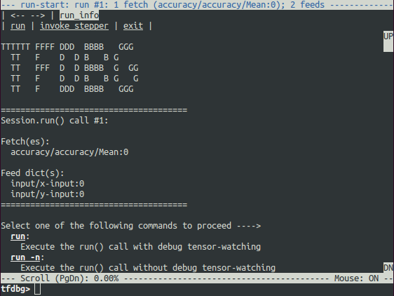

# tensorflow学习笔记（四十三）：使用 tfdb 来 debug

由于 `tensorflow` 在训练的时候是在后台运行的，所以使用 python 的 debug 工具来 debug tensorflow 的执行过程是不可行的，为此，官方提供了一款debug 工具，名为 **tfdb**

有很多人觉得，为了 debug tensorflow 的计算过程又要学习一个新的工具，很烦。

但其实不然，**tfdb** 用起来是十分简单的。以至于简单到我们**只需要增加两行代码**，就可以将之前的模型改成可 `debug` 的。

在 **debug** 界面，

```python
# 第一行： 引包
from tensorflow.python import debug as tf_debug

sess = tf.Session()
# 初始化的 sess 没必要加上 debug wrapper
sess.run(tf.global_variables_initializer())

# 第二行，给 session 加个 wrapper
debug_sess = tf_debug.LocalCLIDebugWrapperSession(sess=sess)
debug_sess.run(train_op) # 用 加了 wrapper 的 session，来代替之前的 session 做训练操作
```

好了，这样就可以了，然后命令行执行：

```shell
python demo_debug.py
# 或者
python -m demo_debug
```

 不一会，下面界面就会出现，就可以开心的 `debug` 了



>  **Tips** : debug 界面中 带 下划线的 东西 都是可以用鼠标点一下，就会触发相应操作的


关于 如何 debug 界面的命令，官方文档有详细的说明 [https://www.tensorflow.org/programmers_guide/debugger#debugging_model_training_with_tfdbg](https://www.tensorflow.org/programmers_guide/debugger#debugging_model_training_with_tfdbg)

核心的几个命令是：

* run ：执行一次 debug_session.run() , 这次执行产生中间 tensor 的值都可以通过 debug 界面查看
* exit ： 退出 debug


## 参考资料

[https://www.tensorflow.org/programmers_guide/debugger](https://www.tensorflow.org/programmers_guide/debugger)


