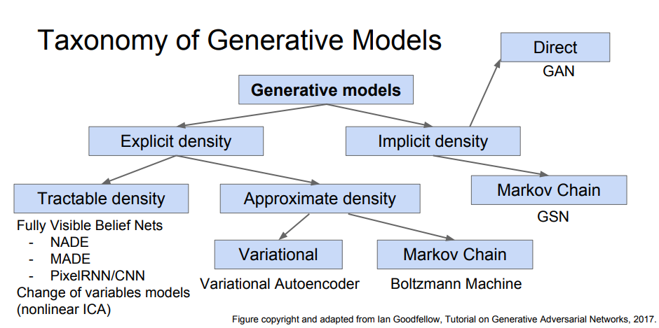

**学习方法（和拥有的数据集有关）**

* 监督学习
* 无监督学习
* 半监督学习

**模型种类（和对数据建模的方式相关）**

* 生成模型
* 判别模型

**无监督学习**

* 只有 data 没有 label
* Learn some underlying hidden structure of the data

# 生成模型

**对于生成模型我们通常对 $P(x; \theta)$ 或者 $P(x, z; \theta)$ 建模**

**目前的生成模型可以分为以下几类**

----

* GAN
* VAE
* autoregressive  model

**生成模型可以做什么呢？**

----

* density estimation, 给定一个 x 输出 $P(x)$， autoregressive model, autoregressive flow
* 图片生成，输入噪声，输出逼真的图片 (GAN, VAE 都可以办到)
* 图片修改，修改图片的某些特征，（VAE 可以做到， GAN 应该也可以）
* 图片复原，给张有缺陷的图片，还原成原始图片（VAE可以做到，GAN应该也可以）

**density estimation**

----

* 我们有一堆无标签的数据，$ D=\mathbf x^{(1)}, \mathbf x^{(2)}, ..., \mathbf x^{(N)} $ , 而我们关心的是 recovering or estimating 它们的概率密度 $p(x)$ 。
* [视频地址](https://vimeo.com/252105837)
* wavenet 和 pixel rnn 不仅仅能够从模型中采样图片/音频，同样也具备 density estimation 的能力。
* 两种 density estimator
  * autoregressive models
  * normalizing flows  ： 从一个简单分布中采样 $\mathbf u \sim N(0, I)$ , 然后经过 神经网络变换 的到一个数据点 $\mathbb x$ 。结构就像是 GAN 中的 G 模型，但是有一点不同，神经网络表示的函数 必须是 invertible 的。这样的话，给定任意 $\mathbf x$ ，都可以估计处其概率 $p(\mathbf x) = p(\mathbf u) |\frac{\partial f}{\partial u}|^{-1}, \mathbf u = f^{-1}(\mathbf x)$ 。可以看出，由于 $f$ 可逆，所以可以通过 $ \mathbf u = f^{-1}(\mathbf x)$  计算得到 $\mathbf u$, 然后利用前一个公式就可以计算得到 $p(\mathbf x)$ .
* AR models **with Gaussian conditionals** are flows, 注意， with Gaussian conditionals 的才是 flow
  * 为什么这么说呢？考虑 AR 模型 $ P(x_t|x_{<t}) = N(\mu, \sigma) $ ，我们应该如何采样 $x_t$ 呢？
    * 从 单变量高斯分布中采样 $z_t$ , 通过 $x_{<t}$ 计算出 $\mu_t, \sigma_t$ , 然后 $x_t = \mu_t+z_t*\sigma_t$ 。
    * 把这个过程整合起来看，就像是先采样 $\mathbf z \sim N(0, I)$ 然后经过一个可逆的神经网络计算得到 $\mathbf x$ 。
  * 这个模型对**采样来说是不友好的**，因为采样有序列过程，无法并行。但是对于 density estimation 却是友好的。给定 $\mathbf x$， 使用 逆变换计算 得到 $\mathbf z$ ，然后再计算概率密度。

## VAE

[https://towardsdatascience.com/intuitively-understanding-variational-autoencoders-1bfe67eb5daf](https://towardsdatascience.com/intuitively-understanding-variational-autoencoders-1bfe67eb5daf)

[https://jaan.io/what-is-variational-autoencoder-vae-tutorial/](https://jaan.io/what-is-variational-autoencoder-vae-tutorial/)

**下面对链接里的文章的内容进行提炼**

* 首先，vae 是个生成模型，生成模型是用来生成图片的
* 理解 vae 要和 ae 对比着看
* ae 的训练会使得 latent space 不够连续，这样对生成图片是不利的
* vae 用了两个方法使得 latent space 足够连续，这样就可以开心的生成图片了。

**这个解释可以看出，采样对于生成模型来说，似乎是非常重要的，因为采样可以使得 latent space 更加连续一点。**

[https://nips.cc/Conferences/2016/Schedule](https://nips.cc/Conferences/2016/Schedule)

**amortized variational inference**

* Monte Carlo gradient estimation and inference network when used together.

## GAN

## 参考资料

[stanford CS231N](http://cs231n.stanford.edu/slides/2018/cs231n_2018_lecture12.pdf)

