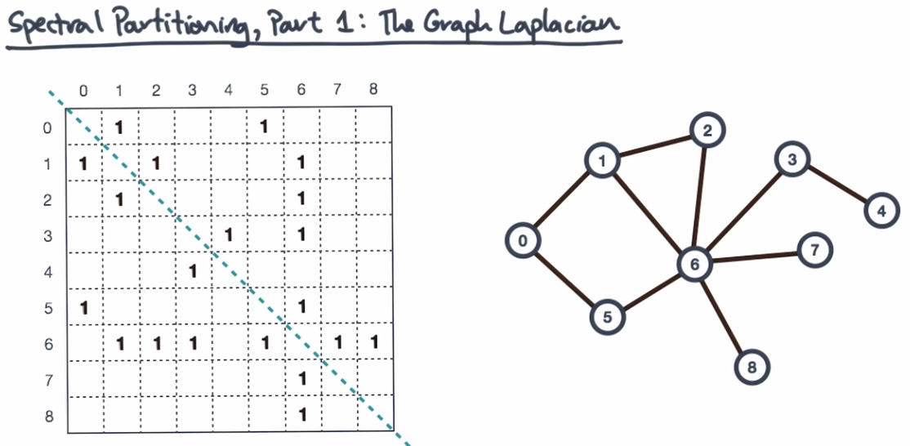
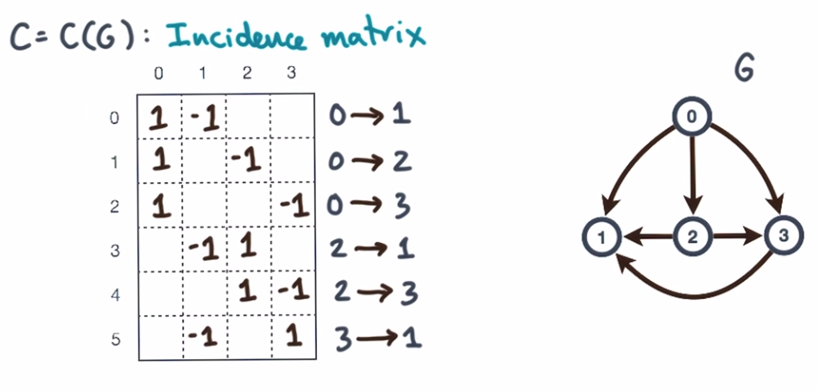
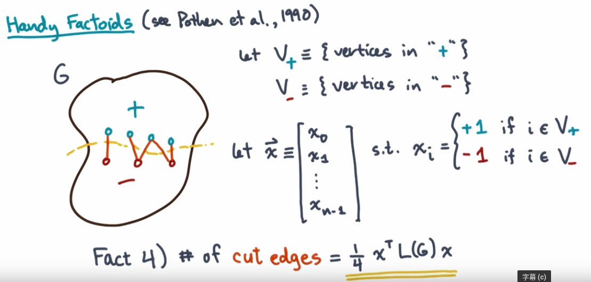

# Materials

[谱聚类（spectral clustering）原理总结](https://www.cnblogs.com/pinard/p/6221564.html)

[http://nlp.csai.tsinghua.edu.cn/~lzy/talks/adl2015.pdf](http://nlp.csai.tsinghua.edu.cn/~lzy/talks/adl2015.pdf)

[A Short Tutorial on Graph Laplacians, Laplacian Embedding, and Spectral Clustering](https://csustan.csustan.edu/~tom/Clustering/GraphLaplacian-tutorial.pdf)

[WWW-18 Tutorial, Representation Learning on Networks](http://snap.stanford.edu/proj/embeddings-www/)

[https://tkipf.github.io/graph-convolutional-networks/](https://tkipf.github.io/graph-convolutional-networks/)

[https://sites.google.com/site/pkujiantang/home/kdd17-tutorial](https://sites.google.com/site/pkujiantang/home/kdd17-tutorial)

[http://www.ipam.ucla.edu/programs/workshops/new-deep-learning-techniques/?tab=schedule](http://www.ipam.ucla.edu/programs/workshops/new-deep-learning-techniques/?tab=schedule)

[http://www.ntu.edu.sg/home/xbresson/pdf/talk_xbresson_gcnn.pdf](http://www.ntu.edu.sg/home/xbresson/pdf/talk_xbresson_gcnn.pdf)

## Spectral Graph Theory

[https://www.youtube.com/watch?v=rVnOANM0oJE](https://www.youtube.com/watch?v=rVnOANM0oJE)

* linear algebraic view of graphs

**adjacency matrix**

* 一个 $N*N$ 的矩阵，$N$ 为 vertex 的个数

**Incidence Matrix**

* $M*N$ 矩阵，N 为 vertex 个数 M为 edge 个数

**Graph Laplacian**

* $L(G)=C^TC$ , 自己算一下可以发现
* Graph Laplacian 给出了一个 原graph的无向图形式。
* 对角线上是 无向图形式的 vertex 的度，非对角线上是当前 vertex 和哪个vertex 有连接（用-1表示的）
* 也可以看出： $L(G)=D-W$ : $D$ 为vertex的degree构成的对角线矩阵，$W$ 是邻接矩阵

**一些结论**

* $L(G)$ 是对称矩阵
* $L(G)$ 有 
  * real-valued, non-negative eigenvalue
  * real-valued, orthogonal eigenvector
*  当且仅当 $L(G)$ 有 $K$ 个值为0的 eigenvalues 时 图 $G$ 有 $K$ 个连接
  * 这个结论告诉我们 Graph Laplacian 的 eigenvalue 的值能够告诉我们一些Graph中vertex的连接情况
  * eigenvector：表示谱中的成分。对于光谱来说就是7种颜色
  * eigenvalue：是谱中成分的值。对于光谱来说就是7中颜色各个的强度
* 如果一个图被分割成 两个部分。$V_+, V_-$ 这个是图语言描述，如果用线性代数语言描述的话就下面的 $\overrightarrow x$ ，这时，分割策略切到了几条边可以用以下公式表示 $\frac{1}{4}x^TL(G)x$ , 通过优化这个目标函数，可以得到最优的切割。

**Lemma**

* $\overrightarrow q_1$ : 第二小的特征值对应的特征向量

# Papers

## 一些理解

* GCN，实际上为不同的节点构建了不同的计算图。