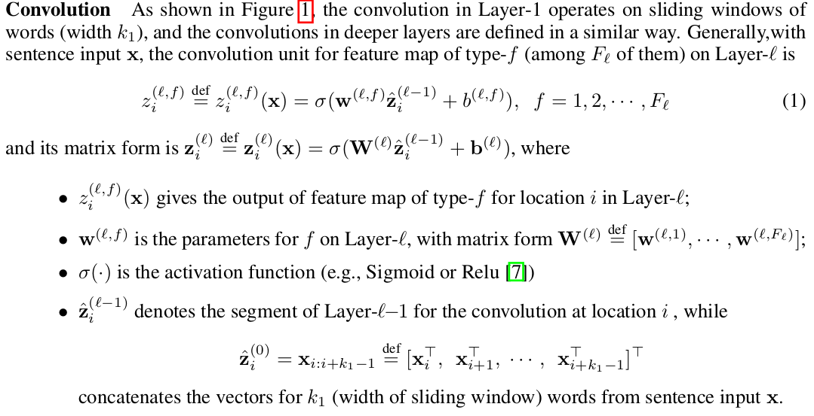

# cnn4sentence matching

论文 Convolutional Neural Network Architectures for Matching Natural Language Sentences 阅读笔记

任务： sentence matching

language：

* internal structures of language objects and the interaction between them

## 文章中的一些表示

* type-$f$ 表示第几个 channel
* $\mathcal l$ 表示第几层
* $z_i^{(l,f)}$ 表示第 $l$ 层 $f$ feature-map 第 $i$ 个位置的值，  $\mathbb z_i^{(l)}$  表示第 $i$ 个位置的特征（across all feature map）。

## 两种结构做 sentence matching

**siamese**

>  it defers the interaction between two sentences (in the final MLP) to until their individual representation matures (in the convolution model), therefore runs at the risk of losing details (e.g., a city name) important for the matching task in representing the sentences
>
> 意思是，siamese 网络结构推迟了 两个句子交互的时间。两个句子直到 MLP 的部分才开始交互，这中情况是不好的，因为 如果提前知道两个句子是什么情况，这样才能更好的从两个句子中提取信息。如果两个句子交互的比较晚的话，前面网络就只会提取一些成熟的特征，这些特征会丢失一些细节信息。

> In other words, in the forward phase (prediction), the representation of each sentence is formed without knowledge of each other.

**为了解决 siamese 网络晚交互的问题，作者提出了第二个网络架构**

> we propose Architecture-II (ARC -II) that is built directly on the interaction space between two sentences. It has the desirable property of letting two sentences **meet before their own high-level representations mature**, while still retaining the space for the individual development of abstraction of each sentence.

> In view of the drawback of Architecture-I, we propose Architecture-II (A RC -II) that is built directly on the **interaction space** between two sentences.
>
> 这句话的重点就是，建立一个 **interaction space**

## 重要句子摘录

> Matching two potentially heterogenous language objects is central to many natural language applications

> Natural language sentences have complicated structures, both sequential and hierarchical, that are essential for understanding them.

> A successful sentence-matching algorithm therefore needs to capture not only the internal structures of sentences but also the rich patterns in their interactions

## 疑问

* 代码怎么写？？？？？

