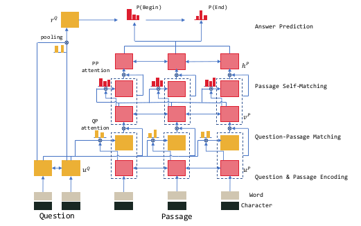
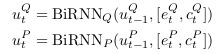
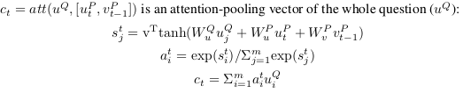
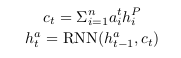

# R-Net

> * We first match the question and passage with gated attention-based recurrent networks to obtain the **question-aware passage representation**. 
> * Then we propose a self-matching attention mechanism to refine the representation by matching the passage against itself, which effectively encodes information from the whole passage. 
> * We finally employ the **pointer networks** to locate the positions of answers from the passages.

>  Our model consists of four parts: 
>
>  * the recurrent network encoder to build representation for questions and passages **separately**,
>  * the **gated matching layer** to match the question and passage
>  * the **self-matching layer** to aggregate information from the whole passage
>  * the **pointer-network** based answer boundary prediction layer. 

## 论文中的符号

$Q = \{w_t^Q \}^m_{t=1}$ : $w$ 代表 $word$ 意思, $m$ 说明这个 Question 有 m 个单词.

$P = \{w_t^P \}^n_{t=1}$ : $n$ 表示 Passage 有 $n$ 个单词

$\{e_t^Q\}_{t=1}^m$ :  Question 的 word-embedding 表示

$\{e_t^P\}_{t=1}^n$ :  Passage 的 word-embedding 表示

$\{c_t^Q\}_{t=1}^m$ :  Question 的 characters-embedding 表示

$\{c_t^P\}_{t=1}^n$ :  Passage 的 characters-embedding 表示

**Question and Passage Encoding**

$\{u_t^Q\}_{t=1}^m$ : Question 的 BiRNN 的 state

$\{u_t^P\}_{t=1}^n$ : Passage 的 BiRNN 的 state

**Gated Attention-based RNN**

$\{v_t^P\}_{t=1}^n$ : 利用 Question 的信息 来编码 Passage 得到的结果, Question-aware passage representation.
$$
v_t^P = \text{RNN}(v_{t-1}^P, [u_t^P, c_t])
$$

Another Gate

**self matching attention**

Question-aware passage representation 的问题在于 对于上下文的信息知之甚少. 

$\{h_t^P\}_{t=1}^n$ :  self-matching attention 的结果, $t$ 时刻的信息由全文决定.

这里也用了上面提到的 Gate

**output layer, Pointer Network**

使用注意力机制来选择 start position ($p^1$) , end position ($p^2$), 

Pointer Network 的初始 state

## 参考资料

[http://yerevann.github.io/2017/08/25/challenges-of-reproducing-r-net-neural-network-using-keras/](http://yerevann.github.io/2017/08/25/challenges-of-reproducing-r-net-neural-network-using-keras/)

[https://codeburst.io/understanding-r-net-microsofts-superhuman-reading-ai-23ff7ededd96](https://codeburst.io/understanding-r-net-microsofts-superhuman-reading-ai-23ff7ededd96)

[https://medium.com/@devnag/pointer-networks-in-tensorflow-with-sample-code-14645063f264](https://medium.com/@devnag/pointer-networks-in-tensorflow-with-sample-code-14645063f264)