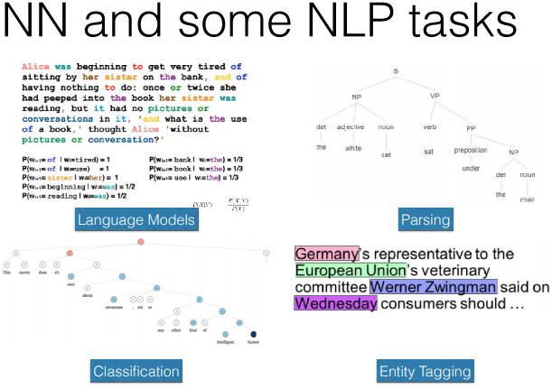

# Document Level Models

## Entity Coreference

在 sentence 模型中，我们考虑将 named entity 检测出来，在 document level 中，考虑的是 named entity 直接之间的指代关系。

**步骤:**

* identify **Noun Phrases mentioning an entity** , 不是 命名实体识别！！！
  * 检测 包含 entity 的 名词性短语
* cluster **noun phrases(mentions)** referring to the same underlying world entity. 
  * 将指代同一个 entity 的 noun phrases 聚类起来。

