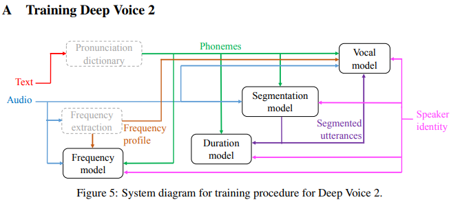
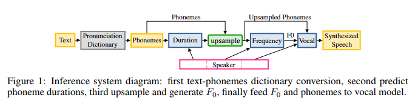
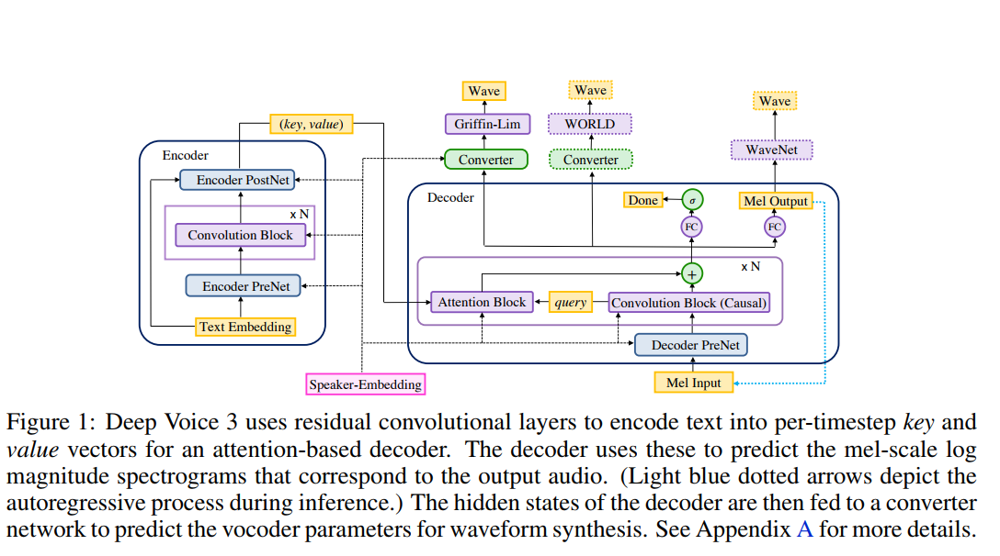
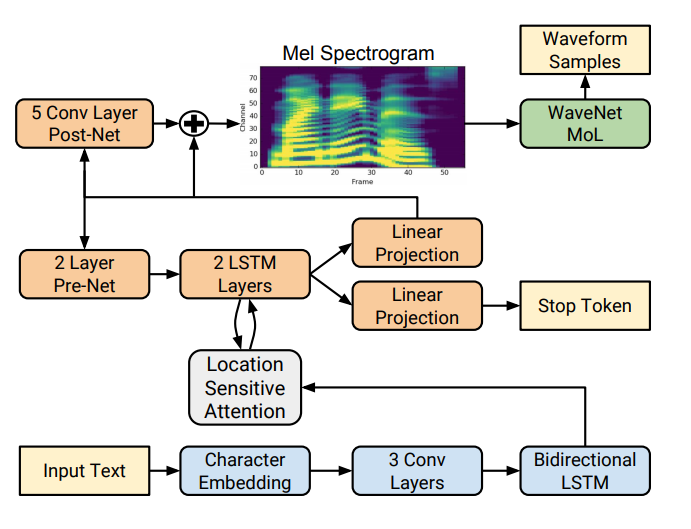
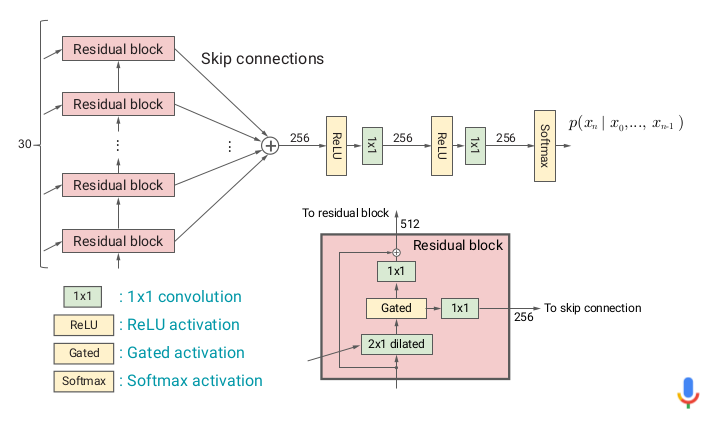
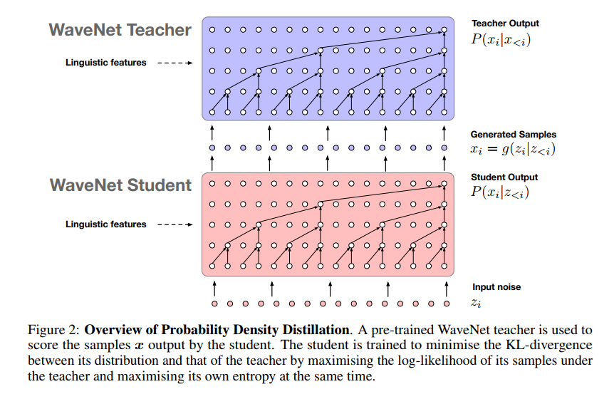

# TTS (Text To Speech)

**根据文本生成音频 (raw audio)**

**TTS 任务的特点**

* 一对多，the same text can correspond to different pronunciations or speaking styles.
* TTS outputs are continuous (感觉也可以是 discrete 的，16-bit 编码嘛)
* outputs sequences are usually much longer that those of the input，（人不可能一秒中说16k个字）。

**传统的 tts 系统通常包含三个部分**

* text analysis fronted
* acoustic model
* audio synthesis

## Deep Voice 1

**text analysis**

* 文本序列转音素序列
* 输入："hello world"。输出："həˈlō wərld" 。

**acoustic model**

* 给定音素，输出声学特征，（`duration prediction` , `fundamental frequency` 等） 
* 输入："həˈlō wərld"， 输出：`duration prediction, fundamental frequency`
* ground truth label 怎么标：
  * duration prediction : **用 audio 和 音素训练一个语音识别模型(`CTC`, 此模型在inference阶段不使用)**，标签为 `<_, h>, <h, e>, ..` , 训练完之后，`<_, h>` 与 `<h, e>` 的距离作为 `h` 的持续时间。
  * fundamental frequency： 直接从音频中计算出来，在音素 duration 中计算出每个音素的 fundamental frequency

**audio synthesis**

* 给定声学特征和音素，合成音频（raw audio）。
* 使用 wave-net。

**特点**

* tts 每个模块都使用深度学习模型替换，灵活性和可扩展性优于传统方法。
* three modules are trained independently, so errors from each component may compound.(如果第一个阶段的 phoneme 分类有错误，那么即使第二个阶段训练的再好，也不可能纠正第一个阶段犯的错误。)

## Deep Voice 2

**key words**

* trainable speaker embedding.
* post-processing neural vocoder.
* can learn hundreds of unique voices from less than half an hour of data per speaker.

**总结**

* not only can a single model generate speech from multiple different voices, but also that significantly less data is required per speaker than when training single-speaker systems.

## Deep Voice 3

**key words**

* avoids recurrent neural networks.
* fully-convolution character-to-spectrogram architecture.

## Tacotron

* 神经网络用作 text to spectrum 的变换，
* 然后用 griffin-lim 算法将 spectrogram 转换成 waveform。griffin-lim 算法无参数，不用学习。

**网络结构**

**encoder**：pre-net + CBHG

**decoder**： content-based tanh attention decoder (输出 mel-spectrum)+ CBHG（输出 linear-spectrum） 

**vocoder** ：Griffin-Lim (算法无参数，不用训练)(一个频谱转 waveform 算法)

**CBHG结构：** 

* 具有 K-gram 建模模块（cnn）。
* 然后基本都是特征上的 transform。

**content-based tanh attention decoder**

**decoder output**

* 傅立叶变换得到的功率谱信息过于冗余（要不然也不会有 mfcc），所以选用 mel 功率谱。
* 一个 decoder step 输出多个 frame 的值
  * 由于每个 phoneme 发音可能占多个帧，所以这种建模方式是合理的
  * 不然的话，可能会使得 模型 attend to the same input token for multiple time-steps.
  * ​

**总结**

* 最终结果：MOS 3.82， human 4.58

* 优点：end-to-end 的优点。
* 缺点：griffin lim 算法能力有点弱。

**一些想法：**

* tacotron 输出的是功率谱，如果换成输出stft 的结果会如何？网络设置两个头，一个 real value 一个 imaginary value， 然后直接调用 istft。
* 为什么使用 content-based tanh attention decoder？如果换成原始 attention 或者 self-attention 会怎么样。
* decoder 的部分由于会存在长时间依赖，换成 dilated convolution 作为 decoder 会如何？
* 替换掉 RNN，用 attention is all you need 中的那些操作。
* 频率谱够了吗？是否需要加点其它东西上去。

## Tacotron 2

**系统组成成分**

* text ---> mel spectrogram (seq2seq + attention)
* mel spectrogram ---> waveform (wavenet)

**网络特点**

* 训练过程，两个部分分开训练。两个部分的梯度是不流通的。
* RNN 部分的训练是 teacher-forcing。

**总结：**

* 最终结果：4.53 ， human 4.58

**与 tacotron1 对比**

* 2 使用 location sensitive attention。这种 attention 鼓励 解码模型一直往后注意
* 使用了 wavenet 作为 vocoder。
* 拿掉了 1 中 CBHG 模块。

## Wave Net (a autoregressive deep generative model)

**将 speech signals 建模为 自回归模型（autoregressive models）**

* 可以 density estimation (高效)
* 可以 sample （慢，因为当前步的采样结果，需要 之前步的结果。）

**wavenet 网络的特点**

- causal dilated convolution: 
  - dilated : 可以捕捉 long-term dependency
  - causal : 满足 autoregressive 模型的特征
- gated convolution + residual + skip : 提供强有力的非线性支持。
- softmax at output : 分类而不是回归。
  - 优点：可以建模任意 distribution （单峰，多峰都没问题）
  - 缺点：对于 softmax 来说，他并不知道 值127 和 128,129 很近。（parallel wavenet 有改进）

**如何使用 wavenet 做 tts 任务**

* 将 linguistic，duration，$F_0$ 作为条件输入到 网络中。或者将 mel-spectrogram 输入网络中。

**总结**

* autoregressive model 对 waveform 建模，使用 dilated convolution 增大感受野。
* 训练时候 可以并行，（teacher forcing）

**优点**

* 效果好。

**缺点**

* inference 时候只能串行（parallel wavenet 对这部分进行了改进，使得在 inference 的时候可以并行）。
* same padding，no pooling layer，显存消耗巨大。
* 因为训练时候 teacher forcing，所以也可能会有 exposure bias 的问题。

## Parallel Wave Net (a inverse autoregressive flow)

**对  wavenet 的两个改进**

* softmax distribution ---> discretized mixture of logistic
* probability density distillation

**问题**

* student 模型真的需要 autoregressive 性质吗？
* 为什么使用 distillation 训练而不直接用真实标签训练。猜想，因为 iaf 模型对 autoregressive 问题建模能力若，所以用 distillation 进行训练更靠谱。（distillation 的提出本来就是为了 压缩模型，用能力小的模型得到大模型的相近的结果。）

## Char2Wav

## 总结

**integrated end-to-end TTS system 的优点**

* alleviating the need for laborious feature engineering, which may involve heuristic and brittle design choices
* it more easily allows for rich conditioning on various attributes, such as speaker or language, or high-level features like sentiment. **HOW???** this is because conditioning can occur at the very beginning of the model.
* adaptation to new data might also be easier. 如果是传统方法，可能还需要继续 feature engineering。浪费时间。
* a single model is likely to be more robust than a multi-stage model where each component's errors can compound.
* 缺点可能就是 需要大量数据了吧。

## 参考资料

[Deep Voice: Real-time Neural Text-to-Speech](http://cn.arxiv.org/pdf/1702.07825.pdf)

[Deep Voice 2: Multi-Speaker Neural Text-to-Speech](http://cn.arxiv.org/pdf/1705.08947.pdf)

[Deep Voice 3: 2000-Speaker Neural Text-to-Speech](http://cn.arxiv.org/pdf/1710.07654.pdf)

[wave net](https://arxiv.org/abs/1609.03499)

[parallel wave net](https://arxiv.org/abs/1711.10433)

[Fast Wave net Generation Algorithm](https://arxiv.org/abs/1611.09482)

[oxford-cs-deepnlp-2017-lectures-text-to-speech](https://github.com/oxford-cs-deepnlp-2017/lectures/blob/master/Lecture%2010%20-%20Text%20to%20Speech.pdf)

[Generative Model-Based Text-to-Speech Synthesis](https://static.googleusercontent.com/media/research.google.com/en//pubs/archive/45882.pdf)