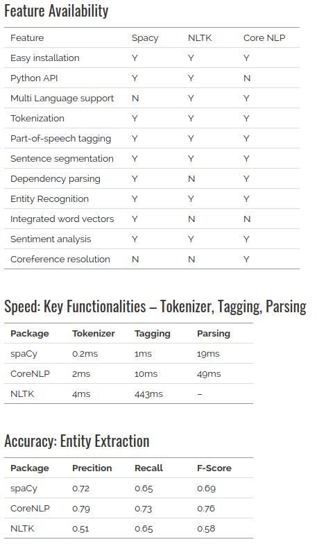

# 使用 spacy 进行自然语言处理（一）


## 介绍

自然语言处理(NLP) 是人工智能方向一个非常重要的研究领域。 自然语言处理在很多智能应用中扮演着非常重要的角色，例如：

*  `automated chat bots`,
*  `article summarizers`,
*  `multi-lingual translation`
*  `opinion identification from data`

每一个利用NLP来理解非结构化文本数据的行业，不仅要求准确，而且在获取结果方面也很敏捷。

自然语言处理是一个非常广阔的领域，NLP 的任务包括

*  `text classification`,
*  `entity detection`,
*  `machine translation`, 
*  `question answering`, 
*  `concept identification`. 

在本文中，将介绍一个高级的 NLP 库 - spaCy 


## 内容列表

1. 关于 spaCy 和 安装
2. Spacy 流水线 和 属性
   1. Tokenization 
   2. Pos Tagging
   3. Entity Detection
   4. Dependency Parsing
   5. 名词短语
3. 与 NLTK 和 coreNLP 的对比


## 1.关于 spaCy 和 安装

### 1.1 关于 Spacy

Spacy 是由 `cython` 编写。因此它是一个非常快的库。 `spaCy` 提供简洁的接口用来访问其方法和属性 governed by trained machine (and deep) learning models.

### 1.2 安装

安装 `Spacy`

```shell
pip install spacy
```

下载数据和模型

```
python -m spacy download en
```

现在，您可以使用 `Spacy` 了。


## 2. Spacy 流水线 和 属性

要想使用 `Spacy` 和 访问其不同的 `properties`， 需要先创建 `pipelines`。 **通过加载 模型 来创建一个 pipeline**。 `Spacy` 提供了许多不同的 [模型](https://github.com/explosion/spacy-models/) , 模型中包含了 语言的信息- 词汇表，预训练的词向量，语法 和 实体。

下面将加载默认的模型- `english-core-web`

```python
import spacy 
nlp = spacy.load(“en”)
```

`nlp` 对象将要被用来创建文档，访问语言注释和不同的 nlp 属性。**我们通过加载一个 文本文件 来创建一个 document** 。这里使用的是从 `tripadvisor's` 网站上下载下来的 [旅馆评论]((https://s3-ap-south-1.amazonaws.com/av-blog-media/wp-content/uploads/2017/04/04080929/Tripadvisor_hotelreviews_Shivambansal.txt))。

```python
document = open(filename).read()
document = nlp(document)
```

现在，`document` 成为 `spacy.english` 模型的一部分，同时 `document` 也有一些 成员属性。可以通过 `dir(document)` 查看。

```python
dir(document)
>> [..., 'user_span_hooks', 'user_token_hooks', 'vector', 'vector_norm', 'vocab']
```

`document` 包含大量的文档属性信息，包括 - `tokens, token’s reference index, part of speech tags, entities, vectors, sentiment, vocabulary etc`.  下面将介绍一下几个属性

### 2.1 Tokenization

```python
"this is a sentence."
-> (tokenization)
>> ['this', 'is', 'a', 'sentence', '.']
```

`Spacy` 会先将文档 分解成句子，然后再 `tokenize` 。我们可以使用迭代来遍历整个文档。

```python
# first token of the doc 
document[0] 
>> Nice

# last token of the doc  
document[len(document)-5]
>> boston 

# List of sentences of our doc 
list(document.sents)
>> [ Nice place Better than some reviews give it credit for.,
 Overall, the rooms were a bit small but nice.,
...
Everything was clean, the view was wonderful and it is very well located (the Prudential Center makes shopping and eating easy and the T is nearby for jaunts out and about the city).]
```

 

### 2.2 Part of Speech Tagging (词性标注)

词性标注： `word` 的 动词/名词/... 属性。这些标注可以作为 文本特征 用到  `information filtering`, `statistical models`, 和 `rule based parsing` 中.

```python
# get all tags
all_tags = {w.pos: w.pos_ for w in document}
>> {83: 'ADJ', 91: 'NOUN', 84: 'ADP', 89: 'DET', 99: 'VERB', 94: 'PRON', 96: 'PUNCT', 85: 'ADV', 88: 'CCONJ', 95: 'PROPN', 102: 'SPACE', 93: 'PART', 98: 'SYM', 92: 'NUM', 100: 'X', 90: 'INTJ'}

# all tags of first sentence of our document 
for word in list(document.sents)[0]:  
    print(word, word.tag_)
>> (Nice, 'JJ') (place, 'NN') (Better, 'JJR') (than, 'IN') (some, 'DT') (reviews, 'NNS') (give, 'VBP') (it, 'PRP') (credit, 'NN') (for, 'IN') (., '.') 

```

下面代码创建一个 文本处理 操作，去掉噪声词。

```python
#define some parameters  
noisy_pos_tags = ["PROP"]
min_token_length = 2

#Function to check if the token is a noise or not  
def isNoise(token):     
    is_noise = False
    if token.pos_ in noisy_pos_tags:
        is_noise = True 
    elif token.is_stop == True:
        is_noise = True
    elif len(token.string) <= min_token_length:
        is_noise = True
    return is_noise 
def cleanup(token, lower = True):
    if lower:
       token = token.lower()
    return token.strip()

# top unigrams used in the reviews 
from collections import Counter
cleaned_list = [cleanup(word.string) for word in document if not isNoise(word)]
Counter(cleaned_list) .most_common(5)
>> [('hotel', 683), ('room', 652), ('great', 300),  ('sheraton', 285), ('location', 271)]
```

 

### 2.3 Entity Detection （实体检测）

`Spacy` 包含了一个快速的 实体识别模型，它可以识别出文档中的 实体短语。有多种类型的实体，例如 - 人物，地点，组织，日期，数字。可以通过 `document` 的 `ents` 属性来访问这些实体。 

下面代码用来 找出 当前文档中的所有 命名实体。

```python
labels = set([w.label_ for w in document.ents]) 
for label in labels: 
    entities = [cleanup(e.string, lower=False) for e in document.ents if label==e.label_] 
    entities = list(set(entities)) 
    print label,entities
```

 

### 2.4 Dependency Parsing

`spacy` 一个非常强大的特性就是 十分快速和准确的语法解析树的构建，通过一个简单的 API 即可完成。这个 `parser` 也可以用作句子边界检测和短语切分。通过 “.children” , “.root”, “.ancestor” 即可访问。

```python
# extract all review sentences that contains the term - hotel
hotel = [sent for sent in document.sents if 'hotel' in sent.string.lower()]

# create dependency tree
sentence = hotel[2] 
for word in sentence:
	print(word, ': ', str(list(word.children)))
>> A :  []  
cab :  [A, from] 
from :  [airport, to]
the :  [] 
airport :  [the] 
to :  [hotel] 
the :  [] 
hotel :  [the] 
can :  []
be :  [cab, can, cheaper, .] 
cheaper :  [than]
than :  [shuttles] 
the :  []
shuttles :  [the, depending] 
depending :  [time] 
what :  [] 
time :  [what, of] 
of :  [day]
the :  [] 
day :  [the, go] 
you :  []
go :  [you]
. :  []
```

下面代码所作的工作是：解析所有 包含 "hotel" 句子的依赖树，看看都用了什么样的形容词来描述 "hotel"。下面创建了一个自定义函数来解析依赖树和抽取相关的词性标签。

```python
# check all adjectives used with a word 
def pos_words (document, token, pos_tag):
    sentences = [sent for sent in document.sents if token in sent.string]     
    pwrds = []
    for sent in sentences:
        for word in sent:
            if token in word.string: 
                   pwrds.extend([child.string.strip() for child in word.children
                                                      if child.pos_ == pos_tag] )
    return Counter(pwrds).most_common(10)

pos_words(document, 'hotel', "ADJ")
>> [(u'other', 20), (u'great', 10), (u'good', 7), (u'better', 6), (u'nice', 6), (u'different', 5), (u'many', 5), (u'best', 4), (u'my', 4), (u'wonderful', 3)]
```

 

### 2.5 Noun Phrases （名词短语）

`Dependency trees` 也可以用来生成名词短语。 

```python
# Generate Noun Phrases 
doc = nlp(u'I love data science on analytics vidhya') 
for np in doc.noun_chunks:
    print(np.text, np.root.dep_, np.root.head.text)
>> I nsubj love
   data science dobj love
   analytics pobj on
```


## 3.与CNTK和core NLP 的对比



## 参考资料

[https://github.com/pytorch/text](https://github.com/pytorch/text)

[https://www.analyticsvidhya.com/blog/2017/04/natural-language-processing-made-easy-using-spacy-%E2%80%8Bin-python/](https://www.analyticsvidhya.com/blog/2017/04/natural-language-processing-made-easy-using-spacy-%E2%80%8Bin-python/)

