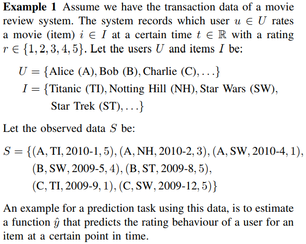

# 推荐系统论文总结

## 常用术语

* sparse data: 特征向量中的元素大部分是0,只有少数是其它值
* 为什么会 sparse：
  * One reason for huge sparsity is that the underlying problem deals with large categorical variable domains。对于 类别的特征，需要用 one hot 来表示，所以就稀疏了， 但是这个问题可以通过 embedding 来解决啊。
* 稀疏带来的问题：学习 特征之间的交互就比较困难
  * 比如 `ax+by+cz=y` : `x, y, z` 为特征值，`a, b, c` 是他们对应的系数，如果特征大部分为0, 即使多给几个这样的等式，也难以正确的估计出 `a,b,c` 所对应的值
* general preference

## Factorization Machine

$$
\hat y(x) = w_0+\sum_{i=1}^{N}w_ix_i + \sum_{i=1}^N\sum_{j=i+1}^N <\mathbf v_i,\mathbf v_j>x_ix_j
$$

* 将 $w_{ij}$ 分解为 $<\mathbf v_i,\mathbf v_j>$ 提高了泛化能力，因为 $w_{ij}$ 只有在$x_i, x_j$ 都不为0的时候才能学习此参数，但是对于 sparse data，这个两个特征同时不为0的概率又非常小。
* 分解了之后，$x_i \neq 0$ 的样本可以学习 $\mathbf v_i$ 参数，对于 $x_j$ 也一样，实现了解偶，好方法
* 一元特征不够用，需要引入多元特征，但是引入多元特征之后发现多元特征共现的次数非常少，所以搞出来了  FM

**疑问？**

* $x_i$ 代表的是一个field，还是只是输入向量的某一维？

  * 如果只是某一维，总感觉有点问题。。。
  * 如果是一个 field，这个公式表示的又不像是那样。。。 amazing
    * 如果是 field，那么 field之间的交互如何定义，因为 field的 one-hot vector长度不一定相同。。。

  ​

## DeepFM

* $V_i$ 解释成 embedding vector。
* 是不是需要 one-step further，把输入搞成 embedding 向量，然后再 FM？
* 怎么定义 high-order interaction，由于 Neural Network可以模拟任何函数，当然 high-order了？ 但是实际上， heaven knows。。。。

## Wide & Deep Learning for Recommender Systems

* Memorization of feature interactions through a wide set of cross-product feature transformations are effective and interpretable, while generalization requires more feature engineering effort.
* With less feature engineering, deep neural networks can generalize better to unseen feature combinations through low-dimensional dense embeddings learned for the sparse features.
* However, deep neural networks with embeddings can over-generalize and recommend less relevant items when the user-item interactions are sparse and high-rank.

## Item-Based Collaborative Filtering Recommendation Algorithms

**two steps**

* 计算相似性
* prediction computation

**Item相似性计算， 如何计算 i 和 j 的相似度**

* cosine based similarity
  * 需要 item 的向量表示

$$
sim(\mathbf i ,\mathbf j)=cos(\mathbf i ,\mathbf j)
$$

* Adjusted Cosine Similarity
  * 只需要评分矩阵就可以了
  * $R_{u,i}$, 表示 用户 $u$ 对物品 $i$ 的评分
  * 需要找到 $\mathbf i, \mathbf j$ 共现的 所有user
  * $\overline R_u$ 是用户 $u$ 评分的均值，这个是为了消除 不同用户打分标准不同的影响

$$
sim(\mathbf i, \mathbf j) = \frac {\sum_{u\in U}(R_{u,i}-\overline R_u)(R_{u,j}-\overline R_u)}{\sqrt{\sum_{u\in U}(R_{u,i}-\overline R_u})^2{\sqrt{\sum_{u\in U}(R_{u,j}-\overline R_u})^2}}
$$

**评分预测**
$$
P_{u, i} = \frac {\sum _{all-similar-items, N}(s_{i,N}*R_{u,N})}{\sum _{all-similar-items, N}(|s_{i,N}|)}
$$

* 目标是计算 用户 $u$ 对 item $i$ 的评分
* 找到和所有 $i$ 相似的 items,用上面计算的相似性，和用户的评分计算 $i$ 的得分。

## Neural Collaborative Filtering (2017)

* user embedding
* item embedding
* 将 user 和 item 的交互从 inner product 换成 神经网络
  * 神经网络有更强的函数拟合能力

* 此文章关注点是在  implicit feedback（看或不看，看多久）上，而不是在 explicit feedback（rating，review）上

**关于数据**

* user-item 交互矩阵 如果 user（$u$） 和 item ($i$) 有交互，则 $y_{u,i}=1$ 否则为 0
  * $y_{u,i}=1$ 并不意味着，$u$ 喜欢 $i$，同样 $y_{u,i}=0$ 也并不意味着 $u$ 不喜欢 $i$
  * 缺乏 negative-sample，negative-sample问题如何解决？
  * 也可以不这么打标签啊。具体业务具体实现
* negative-sample 问题如何解决
  * 采样 unobserved-data 作为负例
  * 如果是 pairwise-learning 的话，observed-data 的得分比 unobserved 的得分低就好

**loss函数**
$$
p(\mathcal Y, \mathcal Y^-) = \prod_{(u,i)\in\mathcal Y} \hat y_{u,i}\prod_{(u,j)\in\mathcal Y^-} (1-\hat y_{u,j})
$$

* $\mathcal Y$ : observed data
* $\mathcal Y^-$ : unobserved data
* mse 的 高斯分布假设很不合适，所以用这种方式来表示 loss
* 用 SGD 更新参数

## Personalized Top-N Sequential Recommendation via Convolutional Sequence Embedding （2018）

* modeling each user as a sequence of items interacted in the past and aims to predict top-N ranked items that a user will likely interact in a "near future"
* more recent items in sequence have a larger impact on the next item

**之前模型的缺点**

* markov model: 缺点来自于其假设，当前状态只和上一状态有关系

**CNN模型的好处**

* 引入 general preference
* 可以建模 1-gram, 2-gram, 3-gram ...

**模型**

* 对每个用户 $u$ , 取出用户的 general preference embedding
* 从用户的交互序列中读取
  * 取出 $L$ 个连续的 items 作为input，
  * 再取 $T$ 个作为 target
* 输出的激活是 sigmoid。ie：多 label 输出
* 对于整个数据集的 likelihood 可以用如下公式表达出来
  * $u$ : 表示 user
  * $C^u$ : 表示我们想要预测的 time-step的集合 {L+1, L+2, ...}
  * $S_t^u$ : 表示用户在 $t$ 时刻与 哪个 item 进行交互了
  * 论文中的公式有问题吧。。。。。。

$$
p(S|\Theta)=\prod_u \prod_{t\in C^u} \sigma(y_{S_t^u}^{(u,t)}) \prod_{j\ne S^u_t} (1-\sigma(y_j^{(u,t)}))
$$

## Outer Product-based Neural Collaborative Filtering (2018)