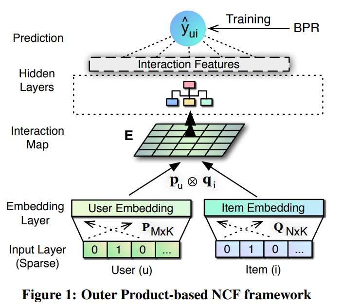
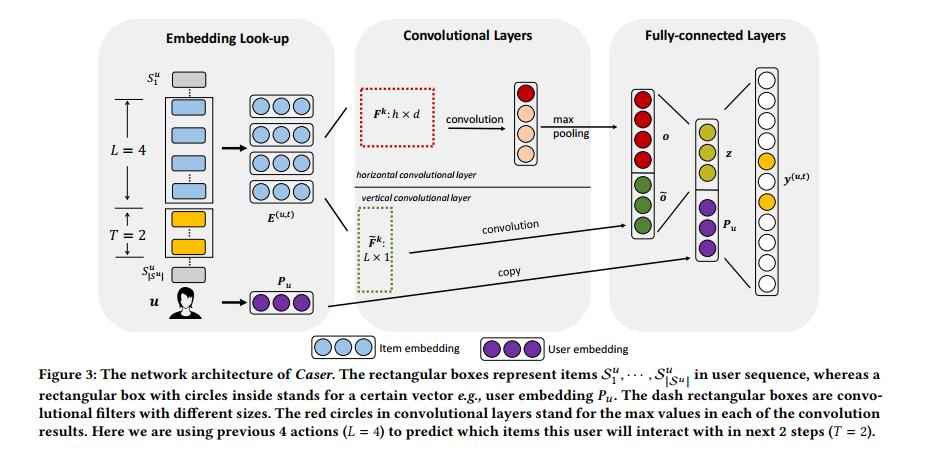

# Summary

1. 更多的从特征的角度出发进行模型优化。（模型结构的变动得到的效果收益往往是比较小的）
   1. 特征首先从两个主体考虑：1）用户维度，2）item 维度
2. Zero-Inflated Data Distribution 的问题
   1. 对于成本回归，直接使用成本回归（MSE）导致全0. 切换为预估某个率，然后再处理，会显得好的多
3. 单调性保证问题（先验知识）
   1. 如果数据中体现不出单调性的话，可以将 amt 相关东西放到模型中
4. 

# 推荐系统论文总结

## 常见特征类型和常见处理方式

**常见特征类型及其处理方式**

* categorical 特征
  * 类别类型: 性别, 各种 id(userid, itemid 等等)
  * 一般使用 $one-hot$, 或者 $embedding$ 表示
* numerical 特征
  * 身高, 体重, 此类特征 (当然, 这些数据也可以进行离散化表示, 然后使用 categorical 特征表示)
  * 一般直接用数值表示, 或者 数值 和 embedding 表示 $x*emb_x$
* 文本特征
  * 如果只是 word, 可以使用 $one-hot$ 或者 $embedding$ 表示
  * 如果是文本: 可以使用 $tf-idf$ , $CBOW$ , $embedding$ 的方式表示
* 图连接特征
  * 常根据图处理为 graph-embedding 

## 特征系统

* id 类特征: 用户id, 物品 id, etc...
* 画像类特征: 年龄, 教育水平, etc...
* 上下文特征: 当前的商圈, 用的什么手机, 当前的时间
* 后验统计类特征: 用户之前浏览过的信息的一些统计特征
* 用户行为特征序列: 用户浏览数据的统计特征

## 常用术语

* sparse data: 特征向量中的元素大部分是0,只有少数是其它值
* 为什么会 sparse：
  * One reason for huge sparsity is that the underlying problem deals with large categorical variable domains。对于 类别的特征，需要用 one hot 来表示，所以就稀疏了， 但是这个问题可以通过 embedding 来解决啊。
* 稀疏带来的问题：学习 特征之间的交互就比较困难
  * 比如 `ax+by+cz=y` : `x, y, z` 为特征值，`a, b, c` 是他们对应的系数，如果特征大部分为0, 即使多给几个这样的等式，也难以正确的估计出 `a,b,c` 所对应的值
* general preference

## 一些简单分类

* 数据 eshow, click, conversion
* 长期兴趣建模, 短期兴趣建模
* top-1 推荐 还是 top-k 推荐
  * 为啥要 top-k, top-k 和 top-1 推荐的方法有啥区别, 为什么会导致这种区别

## Factorization Machine

$$
\hat y(x) = w_0+\sum_{i=1}^{N}w_ix_i + \sum_{i=1}^N\sum_{j=i+1}^N <\mathbf v_i,\mathbf v_j>x_ix_j
$$

* 将 $w_{ij}$ 分解为 $<\mathbf v_i,\mathbf v_j>$ 提高了泛化能力，因为 $w_{ij}$ 只有在$x_i, x_j$ 都不为0的时候才能学习此参数，但是对于 sparse data，这个两个特征同时不为0的概率又非常小。
* 分解了之后，$x_i \neq 0$ 的样本可以学习 $\mathbf v_i$ 参数，对于 $x_j$ 也一样，实现了解偶，好方法
* 一元特征不够用，需要引入多元特征，但是引入多元特征之后发现多元特征共现的次数非常少，所以搞出来了  FM
* $x_i$只是输入向量的某一维.

**逻辑斯特回归方法存在的问题**

* 首先是输入特征的构建: one-hot(multi-hot) 特征拼接在一起然后输入到模型中.就像是这样, 4个slot, `01,001000,000000001,10000000,11100000`. 如果4个特征值的slot与5个特征值的slot特征交叉, 就会构建一个20个特征值的slot, 这样无疑会更加增大输入特征的稀疏性.
* 逻辑斯特回归方法会为每个 **特征值** 分配一个参数.
* 有些特征值出现的次数很少, 会增加学习的困难程度.

**FM的解决特征稀疏的方法**

* 对每个独立的特征值分配embedding
* 将交叉特征的 稀疏分解为 独立的特征的 embedding 的内积.

**FM 就像 Embedding 一样**

* 每个人用一个 embedding 表示
* 每个电影用 3 个 embedding 表示
  * 表示 **active item** 的 embedding (此次要预测的 item 的 embedding)
  * 表示 item 评分的 embedding
  * 表示 对 此电影评分时（active item），上一次看了啥电影的 embedding
* 时间维度用一个 embedding 表示

----

* 这里需要注意的是，电影评分的 embedding 和 时间维度的 embedding
  * 电影评分：不同的电影会有不同的评分，一个电影会有多个评分。这里对 **电影-评分** 存在两种 embedding 方式。
    * 将 **电影-评分** 进行 embedding：这样就会有  $|Movies|*|RankLevels|$ 个 embedding
    * 将电影进行 embedding，评分仅对 embedding 的长度进行 rescale，这样就只有 $|Movies|$ 个 embedding 了。文中采用的就是这种方式。 这种简单的分解是不是有些问题，如果将 $RankLevel$ 也给 embedding 了，是不是更好。
  * 时间维度的也同理，
    * 对时间概念进行 embedding，然后具体时间的 embedding 是对时间概念embedding 的 rescale。
    * 这样进行处理没啥问题吗？

## FFM (域感知因子分解机)

* 在因子分解机中, 每个特征 $i$ 与其它特征进行交互时用的都是 $v_i$, 这样就无法表示出与不同特征域交叉的区别. 
* FFM 对于每个特征值, 对于不同的Field学习不同的 embedding.

$$
\hat y=\mu+<w, x> + \sum_{i=1}^{n}\sum_{j=i+1}^n <v_{_{(i, f_j)},v_{_{(j, f_i)}}}>x_ix_j
$$

## FwFM (field-weighted Factorization Machines)

* FFM方法成倍增加了需要学习的参数的数量
* FwFM仅需要不同域之间的交叉权重即可.

$$
\hat y=\mu+<w, x> + \sum_{i=1}^{n}\sum_{j=i+1}^n <v_i, v_j>x_ix_jr_{(f_i, f_j)}
$$

## DeepFM

**FM存在的问题**

* 撑死只有二阶特征交互, 实际情况可能需要更高阶的特征交互

**Deep FM**

* 将FM和全连接配合使用.
* FM负责一阶+二阶交互, 全连接负责更高阶的交互.
* 两个的输出 加起来 然后sigmoid激活.

* $V_i$ 解释成 embedding vector。
* 是不是需要 one-step further，把输入搞成 embedding 向量，然后再 FM？
  * （FM其实就是embedding，只是一个**建模了 low-order feature interaction 的模型** ，虽然可以建模 higher-order，但是复杂度就太大了。）
* 怎么定义 high-order interaction，由于 Neural Network可以模拟任何函数，当然 high-order了？ 但是实际上， heaven knows。。。。
  * higher-order interaction，多个特征存在直接交互。比如 order-2 的 FM，仅仅有两个特征之间的直接交互，order-10 的 FM，就可以看作 high-order interaction 了。
* 用 CNN 也可以建模 high-order 的特征交互吧
  * dilated cnn
  * deformable cnn ????

**关于此篇论文**

* FM 用来建模 low-order feature interactions （用来捕捉比较通用的信息）
* DNN 建模 high-order feature interactions（刻画更加细节的信息）

## Wide & Deep Learning for Recommender Systems

* Memorization of feature interactions through a wide set of cross-product feature transformations are effective and interpretable, while generalization requires more feature engineering effort.
* With less feature engineering, deep neural networks can generalize better to unseen feature combinations through low-dimensional dense embeddings learned for the sparse features.
* However, deep neural networks with embeddings can over-generalize and recommend less relevant items when the user-item interactions are sparse and high-rank. （意味着数据量量少，不足以训练出一个优秀的神经网络。）

**文中提到的 Memorization 和 Generalization**

* Memorization can be loosely defined as learning the frequent, co-occurrence of items or features and exploiting the correlation available in the historical data.
  * 因为 wide 部分模型能力小，会 under-fitting。所以只会记住 高频的一些特性
* Generalization， 对于出现频率不高的 pair 也会有自己的判断。但是由于 数据的 sparse 和 high-rank，导致训练数据不足，没法有效的学习出 正确的 embedding 表征，所以就会过拟合。

**wide**

* 输入部分是 raw input features 和 transformed features
  * raw input features ： `[性别，语言，年龄]`  

**deep**

* embedding 走起

## Item-Based Collaborative Filtering Recommendation Algorithms

**two steps**

* 计算相似性
* prediction computation

**Item相似性计算， 如何计算 i 和 j 的相似度**

* cosine based similarity
  * 需要 item 的向量表示

$$
sim(\mathbf i ,\mathbf j)=cos(\mathbf i ,\mathbf j)
$$

* Adjusted Cosine Similarity
  * 只需要评分矩阵就可以了
  * $R_{u,i}$, 表示 用户 $u$ 对物品 $i$ 的评分
  * 需要找到 $\mathbf i, \mathbf j$ 共现的 所有user
  * $\overline R_u$ 是用户 $u$ 评分的均值，这个是为了消除 不同用户打分标准不同的影响

$$
sim(\mathbf i, \mathbf j) = \frac {\sum_{u\in U}(R_{u,i}-\overline R_u)(R_{u,j}-\overline R_u)}{\sqrt{\sum_{u\in U}(R_{u,i}-\overline R_u})^2{\sqrt{\sum_{u\in U}(R_{u,j}-\overline R_u})^2}}
$$

**评分预测**
$$
P_{u, i} = \frac {\sum _{all-similar-items, N}(s_{i,N}*R_{u,N})}{\sum _{all-similar-items, N}(|s_{i,N}|)}
$$

* 目标是计算 用户 $u$ 对 item $i$ 的评分
* 找到和所有 $i$ 相似的 items,用上面计算的相似性，和用户的评分计算 $i$ 的得分。

## Neural Collaborative Filtering (2017)

* user embedding
* item embedding
* 将 user 和 item 的交互从 inner product 换成 神经网络
  * 神经网络有更强的函数拟合能力

* 此文章关注点是在  implicit feedback（看或不看，看多久）上，而不是在 explicit feedback（rating，review）上

**关于数据**

* user-item 交互矩阵 如果 user（$u$） 和 item ($i$) 有交互，则 $y_{u,i}=1$ 否则为 0
  * $y_{u,i}=1$ 并不意味着，$u$ 喜欢 $i$，同样 $y_{u,i}=0$ 也并不意味着 $u$ 不喜欢 $i$
  * 缺乏 negative-sample，negative-sample问题如何解决？
  * 也可以不这么打标签啊。具体业务具体实现
* negative-sample 问题如何解决
  * 采样 unobserved-data 作为负例
  * 如果是 pairwise-learning 的话，observed-data 的得分比 unobserved 的得分低就好

**loss函数**
$$
p(\mathcal Y, \mathcal Y^-) = \prod_{(u,i)\in\mathcal Y} \hat y_{u,i}\prod_{(u,j)\in\mathcal Y^-} (1-\hat y_{u,j})
$$

* $\mathcal Y$ : observed data
* $\mathcal Y^-$ : unobserved data
* mse 的 高斯分布假设很不合适，所以用这种方式来表示 loss
* 用 SGD 更新参数

## Attentive Collaborative Filtering: Multimedia Recommendation with item- and component- level attention (2017)

* 用户喜欢一段视频 或者 一个图片，可能仅仅是对 视频/图像 的一部分感兴趣。
* 可以达到更精确的特征刻画

## Latent Relational Metric Learning via Memory-based Attention for Collaborative Ranking (2018)

- instead of simple push-pull mechanisms between user and item pairs, we propose to learn **latent relations** that describe each user and item pairs
- Considering the **many-to-many nature** of the collaborative ranking problem, enforcing a good fit in vector space can be really challenging from a geometric perspective especially since the optimal point of **each user and item is now a single point in vector space.** 
  - 解释了为什么 push-pull user vector 和 item vector 不好。

* 提出了一个 memory 模块。假设用户 为 p，item 为 q
  * 如果 p 喜欢 q，那么 memory 模块计算 p-q （即：r）。
  * 如果 p 不喜欢 q，那么 memory 模块随便算算就好。
  * 训练过后，可以解释为，memory 模块记住了出现在训练集中的 user-item pair 之间的关系，没有出现在训练集中的 pair，memory 模块对他们的关系描述并不准确。
* 此模型能达到相似的user 的 embedding 在一块，相似的 item 的embedding 在一块吗？
  * 如果模型能力过强的话，会记住 训练集中的 pair，即使 user embedding 和 item embedding 随机初始化，在训练的时候不更新，此模型在训练集上也会表现很好。
  * memory 模块在学习 $f(p, q)=p-q$ ，但是 memory 模块并没有这么灵活，他仅仅是提供了一些 memory slice，希望模型能通过 memory slices 组合出来 $p-q$ 的值。**$p-q$** 是可以充满整个 **N维** 空间的，而 memory slices的组合只能充满一个 **M维** 子空间而已。
  * 所以此模型为了降低 loss，也会将 $p$ 和 $q$ 移动到一个子空间上。**移动的时候会形成聚簇？** 
    * 假设有两类用户，两个 item，一个 r，可以分析的确可以学习出来用户的聚簇。
    * 复杂情况就说不清了。。。。。

## Outer Product-based Neural Collaborative Filtering (2018)

聚焦到 user-embedding 和 item-embedding 上来

- 考虑 user-embedding 中的每个维度 和 item-embedding 中的每个维度之间的特征交互
- outer product 就有种 FM 的感觉了，又有些区别，FM还需要 user-embedding 自己的 cross-product。

## Personalized Top-N Sequential Recommendation via Convolutional Sequence Embedding （2018）

* modeling each user as a sequence of items interacted in the past and aims to predict top-N ranked items that a user will likely interact in a "near future"
* more recent items in sequence have a larger impact on the next item

**之前模型的缺点**

* markov model: 缺点来自于其假设，当前状态只和上一状态有关系

**CNN模型的好处**

* 引入 general preference
* 可以建模 1-gram, 2-gram, 3-gram ...

**模型**

* 对每个用户 $u$ , 取出用户的 general preference embedding
* 从用户的交互序列中读取
  * 取出 $L$ 个连续的 items 作为input，
  * 再取 $T$ 个作为 target
* 输出的激活是 sigmoid。ie：多 label 输出
* 对于整个数据集的 likelihood 可以用如下公式表达出来
  * $u$ : 表示 user
  * $C^u$ : 表示我们想要预测的 time-step的集合 {L+1, L+2, ...}
  * $S_t^u$ : 表示用户在 $t$ 时刻与 哪个 item 进行交互了
  * 论文中的公式有问题吧。。。。。。

$$
p(S|\Theta)=\prod_u \prod_{t\in C^u} \sigma(y_{S_t^u}^{(u,t)}) \prod_{j\ne S^u_t} (1-\sigma(y_j^{(u,t)}))
$$

## Session-Based Recommendations with Recurrent Neural Networks (2016)

## RealTime Personalization using embeddings for search ranking at airbnb

* 业务场景特点
  * 用户每次搜索 都有强烈的 目标驱动
  * 用户在一个 session 中的点击 具有强相关性, 
* 使用数据类型, click 和 conversion

**模型1 (短期兴趣建模, 使用 click session 的信息)**

* Skip-gram model for listing embeddings  
  * 用户的点击 session
    * booked session : 带有 booking 的 session
    * exploratory session : 不带有 booking 的 session
  * 用户 session  到 句子上的映射
    * session --> 句子
    * session 窗口 --> 句子窗口
  * 模型训练
    * booked session: 不仅预测上下文, 还预测最终的订阅
    * exploratory session: 仅预测上下文

**模型2(长期兴趣建模, 使用 booking session 的信息)**

* user-type & listing-type embeddings
* 

**如何处理冷启动**

* 使用 meta 信息找相似, 这个需要统计一下 cover 度

**其它**

* 数据稀疏 如何处理
  * 将特征分解成 独立的多个部分, 然后训练模型. Eg. 将user_id分解为user的一些基本属性, 使用属性表示人
* 长期兴趣的建模 如果 处理用户兴趣变化的问题

## Deep Neural Networks for YouTube Recommendations

* Example age:
  * 视频的热度和时间是相关的(在某些时间, 视频的点击率会非常高, 过了那段时间, 点击率就比较低), 模型该如何设计才能学习到最近的视频热度信息呢? 如果不考虑时间因素, 视频的热度的预测在时间维度上是取平均的, 显然不合适.
  * 本文中引入了 example age 特征, 在训练的时候 特征值为 样本的eshow时间与模型训练时间的 差值(正数, 当前时间为 0). 在预测的时候, example age 固定为0, 这样就可以预测当前最热门的话题了.

# 推荐系统中存在的一些偏置

[http://www.cs.virginia.edu/~hw5x/Course/IR2017/_site/docs/Presentations/yj9xs.pdf](http://www.cs.virginia.edu/~hw5x/Course/IR2017/_site/docs/Presentations/yj9xs.pdf)

* position bias (item 的展现位置会对点击率造成一定影响)
* presentation bias
* trust bias

## Unbiased Learning-to-Rank with Biased Feedback

* (通过专家标注学习ranking model)专家标注相关性存在问题: query 和 document 的相关性
  * pooling bias: 由于不可能全标, 所以只能选一部分标相关性, 这会导致 pooling bias
  * 专家也有可能标错
* (通过用户的隐式反馈学习ranking model)
  * 没有看到的 feedback 导致的不利影响 高于 专家标错的影响
    * 关于推荐系统中用户的点击行为可以分为以下几类
      * 看到 点击 (相关)
      * 看到 不点击 (不相关)
      * 没看到 不点击 (Unk)
    * 一般在模型训练的时候 仅仅是考虑 展现的那部分的 item 的点击与不点击行为
      * 展现 点击 (相关)
      * 展现 不点击 (又分为 看到-不点击, 没看到-不点击)
      * 不展现
    * 由于训练数据 并不是整体 item, 所以希望模型的泛化能力更加优秀一些
      * ps(总感觉现在模型的训练是 hard-mining 的方式)

**数学符号含义**

* $N, K$ : $N$ 个query, $K$ 个 item, 
* $r_i(y)$ : 表示query $\pmb x_i$ 与某个 item $y$ 的相关性
* $\Delta(\pmb y|\pmb x_i, r_i)=\sum_{y\in\pmb y}\text{rank}(y|\pmb y)*r_i(y)$ , performance measure, 相关性的计算包含了所有的 item
  * 本文所提出的模型中, 认为 存在一个真实的$\pmb r_i(\pmb y)$ 相关性向量, 但是, 对于每个 query 来说, 相关性是部分 可见的
* $\pmb o_i \sim \mathbf P(\pmb o| \pmb x_i, \pmb{\overline y_i}, r_i)$ , 给定一个 ranking $\pmb{\overline y_i}$ ,  $\pmb o_i\in\{0,1\}^K$ indicating which relevance values were revealed
  * 相关性是真实存在的, 但是在一次  query 中, 不可能观测到所有的相关性, 所以才有这么一个概率
* $Q(o_i(y)=1|\pmb x_i, \pmb{\overline y_i}, r_i)$ , marginal probability, 表示观察到 相关性$r_i(y)$ 的概率

未完待续...

## Slate-Q

* State: 一次推荐一个 set, 而不是一次推荐一个

  * 和 top-k 推荐的区别是什么???

* simulation environment

  * 用户: 用户通过对于 topic 的兴趣进行建模 $\mathbf u\in [-1,1]^{|T|}$,-1表示对此topic 完全不感兴趣, 1表示非常感兴趣.
    * 用户有一个 budget, budget随着时间以固定速率下降, 但是如果consume一个满意的东西的时候, 用户的 budget 会稍稍增长一下
  * Document:
    *  $|D|$ 个文档, $|T|$ 个 topic, 一个文档仅包含一个 topic. 所以一个 文档可以用一个 $\mathbf d\in \{0,1\}^{|T|}$ 的向量表示. 
    * 每个文档还有一个不可见的属性 $quality ~L_d$ , drawn randomly from $N(\mu_{T_d}, \sigma^2)$, $\mu_t$ 为topic $t$ 的平均质量. 不同 topic 的质量是不同的.
    *  
  * 用户和 文档特征向量的内积表示 对此 document 的感兴趣程度

* MDP

  * 环境

  * 状态

  * 动作: 先取 $m$ 个 candidate, 然后从其中取 $k$ 个做 slate recommendation

  * 奖励: 用户从 相关性分布中 采样一个 document (consume)

    * 当用户 consume 一个 document 的时候, 此用户对于该 document 所对应的 topic 的兴趣是稍微增加的.

  * 状态转移概率

    * 用户的状态会被consumed 的document所影响(相关性和质量)

  * 衰减因子
