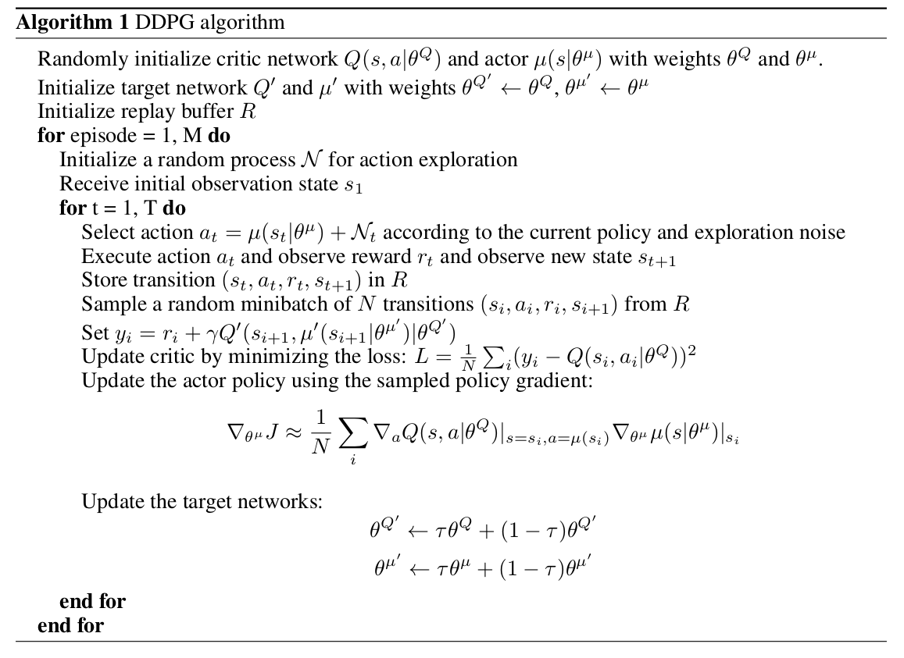

# DDPG

**Key Word**

* actor-critic
* model free
* deterministic policy gradient
* continuous action spaces

## DQN

DQN 可以解决 的问题具有以下特点

* 高维 observation spaces 
* 低维离散 action spaces 

但是对 高维 连续 action spaces 问题却无能为力。

**DQN** 如何应用在 连续 action 问题上：

* 连续 action 离散化，因为 $\max\limits_{a'} Q(s',a')$ 比较让人恼火，这种方法会导致 **维数灾难**。

## DDPG

* can learn competitive policies for the task using **low dimensional observations** 
* **In many cases** , also be able to learn good policies directly from pixels
* 对高维 state 效果应该不咋地
* learn in large state and action spaces **online** , 这个 online 是什么意思嘞。

**DDPG 如何解决 数据 iid 问题的？**

* 和 DQN 中一样，使用 replay buffer 解决问题
* replay buffer 中保存 transition $(s_t, a_t, r_{t+1}, s_{t+1})$
* 每个 timestep，`actor` 和 `critic` 通过从 replay buffer 中 sample 出 mini-batch 训练
* 借鉴了 DQN 中target-network 的方法
  * DQN 中 有两个网络 Q-net，target-net，Q-net每个 mini-batch 都会更新，target-net 每隔几步更新一次（将 Q-net 中的参数复制过去）
* DDPG中，actor 和 critic 都搞了一个副本，用来计算 target-value 的，这两个副本网络的参数更新方法是 moving-average 更新的。

 target $u'(s), Q'(s,a)$ 的存在对于训练的稳定性是十分必要的！！！！！

**Deterministic policy 方法中的 exploration 问题 DDPG 是怎么解决的**

DDPG 是 off-policy 的，所以还是听容易加 exploration 策略的（在 behavior policy 上加）。因此，DDPG 构建了一个 exploration policy 
$$
u'(s_t) = \mu(s_t|\theta_t^\mu)+\mathcal N
$$
$\mathcal N$ 是个 noise process

## 整体结构

* actor-network $\mu(s|\theta^\mu)$,   critic-network $Q(s,a|\theta^Q)$
* target-actor-network $\mu'(s|\theta^{\mu'})$, target-critic-network $Q'(s,a|\theta^{Q'})$

* **critic** 的更新用到了 next state， **actor** 的更新仅用到了 state
* action 也可以是离散的，behavior - action 是离散，target  - action 是连续

## 一些细节

低维 state 空间，如何处理 特征成分的 **取值范围不一致** 问题（positions vs velocities）：

* 手动放缩这些 特征成分的 取值范围
* 使用 batch-norm，batch-norm 会将一个 mini-batch 中的数据处理成 0 均值，1 方差（用了 bn 就没必要手动设置 特征成分的 range 了！！！ 牛牛牛）

**network detail**

* $u(s), Q(s,a)$ 中都用了 bn

**使用了 action repeats，这个是啥子？**

*  每个 time-step，一个 action 跑三次，每次的 observation 都记录下来
*  然后将这 9 个（RGB×3） feature map 搞成一个 observation。

## 总结

* target-network 这个设置是很重要的（DQN，DDPG）中都有用到

## Glossary

* learn on-line，一次训练一个样本（看到一个样本，就更新一次），与用 mini-batch 学习相反
* on policy
* off policy
* action repeats

