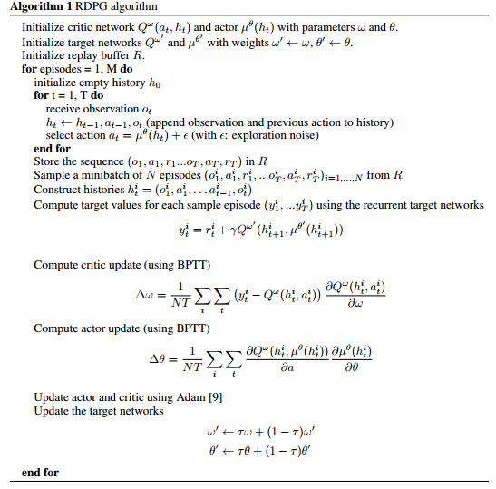

# Memory-based control with recurrent neural networks

**Key Words**

* POMDP
* model-free
* continuous control
* RNN

## 文章阅读

**POMDP**

> A POMDP is described a set of environment states $\mathcal S$ and a set of actions $\mathcal A$ , an initial state distribution $p_0(s_0)$, a transition function $p(s_{t+1}|s_t,a_t)$ and reward function $r(s_t,a_t)$ . This underlying MDP is partially observed when the agent is unable to observe the state $s_t$ directly and instead receives observations from the set $\mathcal O$ which are conditioned on the underlying state $p(o_t|s_t)$
>
> 意思大概就是：agent 看不到 $s_t$， 但是  agent 可以看到 $o_t$

> The agent only indirectly observes the underlying state of the MDP through the observations. An optimal agent may, in principle, require access to the entire history $h_t=(o_1, o_2, o_3,....)$

## 算法

需要注意的几点是：

* 每次往 Replay Buffer 中存 一个  episode （DQN 是每次传一个 transition！！！）

## 总结

文章的特点就是：**用 rnn 来编码 observation **， 没啥特殊的。