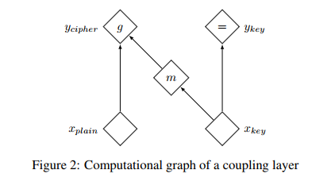

# Deep reversible nets

**什么是 deep reversible nets**

* 神经网络代表一个函数，这个函数是可逆的。
* i.e. : $y = f(x), x = f^{-1}(y)$ 
* 但是目前常用的网络如同 VGG, AlexNet, resnet, etc . 都是不可逆的

**reversible 性质有什么好处**

* 可以用上概率论中的一个公式 $p(y) = p\Bigr(g(y)\Bigr)\Biggr|\text{det}(\frac{d g(y)}{dy})\Biggr|$
* $y = f(z), z = g(y), g = f^{-1} $ 
* 如果想要知道 $p(y)$ , 只需要用上面的公式计算出来就可以了。
* 可以使用 极大似然来计算 $p(x)$ 了

**reversible 用在哪**

* VAE
* 生成模型

**reversible net的难点**

* 如何设计一个 reversible net (逆好算，det也好求)

**代表论文**

[NICE: Non-linear Independent Components Estimation](https://arxiv.org/abs/1410.8516)

## NICE: non-linear independent components estimation

> a good representation is one in which the data has a distribution that is **easy to model**
>
> * 所以就假设 $p(\mathbb z)=\prod_{i=1}^D p(z_i)$ 
>
> instead of modeling directly complex data by learning over a complex parametric family of distributions, we will learn a non-linear transformation of the data distribution into a simpler distribution via maximum likelihood.

* 这个结构是可逆的，而且 det 也好求。

## Density Estimation Using Real NVP

[一个 summary](http://www.shortscience.org/paper?bibtexKey=journals/corr/1605.08803)

> VAE: maximizing a variational lower bound on the log-likelihood
>
> GAN: 无法获得 样本的概率值。

* 将 CNN 和 batch-norm 引入了

## Glow: Generative Flow with Invertible 1*1 Convolutions

* 比 realNVP 多了个 1×1 的卷积层。
* channel 之间的信息交互的更加有效

