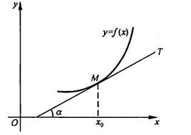
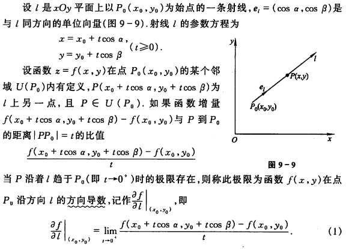
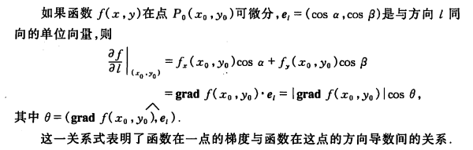

# 优化方法--牛顿法

## 梯度

导数的定义（斜率）：
$$
\lim_{x\rightarrow x_0} \frac{f(x)-f(x_0)}{x-x_0}
$$
几何意义为：$f'(x) = \tan(\alpha)$

**为什么梯度是loss下降最快的方向**

方向导数：函数延任意指定方向的变化率问题，**方向导数是标量**

定理：
$$
\frac{\partial f}{\partial l}\Bigr|_{x_0,y_0} = f_x(x_0,y_0)\cos\alpha+f_y(x_0,y_0)\cos\beta
$$

* 其中， $\cos\alpha, \cos\beta$ 是方向 $l$ 的方向余弦，就是单位方向向量。

**梯度是向量：梯度是下降最快的方向**
$$
grad = f_x(x_0,y_0)\mathbf i+f_y(x_0,y_0)\mathbf j
$$

所以说，**梯度是下降最快的方向**

