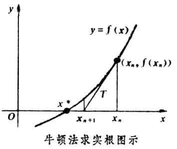

# 优化方法--牛顿法

## 梯度

导数的定义（斜率）：
$$
\lim_{x\rightarrow x_0} \frac{f(x)-f(x_0)}{x-x_0}
$$
几何意义为：$f'(x) = \tan(\alpha)$

**为什么梯度是loss下降最快的方向**

方向导数：函数延任意指定方向的变化率问题，**方向导数是标量**

定理：
$$
\frac{\partial f}{\partial l}\Bigr|_{x_0,y_0} = f_x(x_0,y_0)\cos\alpha+f_y(x_0,y_0)\cos\beta
$$

* 其中， $\cos\alpha, \cos\beta$ 是方向 $l$ 的方向余弦，就是单位方向向量。

**梯度是向量：梯度是下降最快的方向**
$$
grad = f_x(x_0,y_0)\mathbf i+f_y(x_0,y_0)\mathbf j
$$

所以说，**梯度是下降最快的方向**

## 牛顿法

牛顿法可以用在以下两个方面：

* 求解方程的跟 $f(x)=0, x=?$
* 最优化问题

**求解方程的根**
$$
\begin{aligned}
f(x) &\approx f(x_0)+f'(x_0)*(x-x_0) \\
f(x)=0 &\Leftarrow\Rightarrow  f(x_0)+f'(x_0)*(x-x_0) \\
&\Rightarrow x=x_0-\frac{f(x_0)}{f'(x_0)}
\end{aligned}
$$

$ x=x_0-\frac{f(x_0)}{f'(x_0)}$ 只是一个近似解，但是通过不停的迭代这个式子$ x_{t+1}=x_t-\frac{f(x_t)}{f'(x_t)}$，最终会收敛 !!!

**最优化**

方程的根的问题是 求 $f(x)=0$ 的问题，最优化的问题是求 $f'(x)=0$ 的问题。为了求解 $f'(x)=0$, 需要泰勒展开到二阶：
$$
\begin{aligned}
f(x) &\approx f(x_0)+f'(x_0)*(x-x_0) + f''(x_0)\frac{(x-x_0)^2}{2!} \\
\end{aligned}
$$

## 参考资料

[http://jacoxu.com/jacobian%E7%9F%A9%E9%98%B5%E5%92%8Chessian%E7%9F%A9%E9%98%B5/](http://jacoxu.com/jacobian%E7%9F%A9%E9%98%B5%E5%92%8Chessian%E7%9F%A9%E9%98%B5/)

