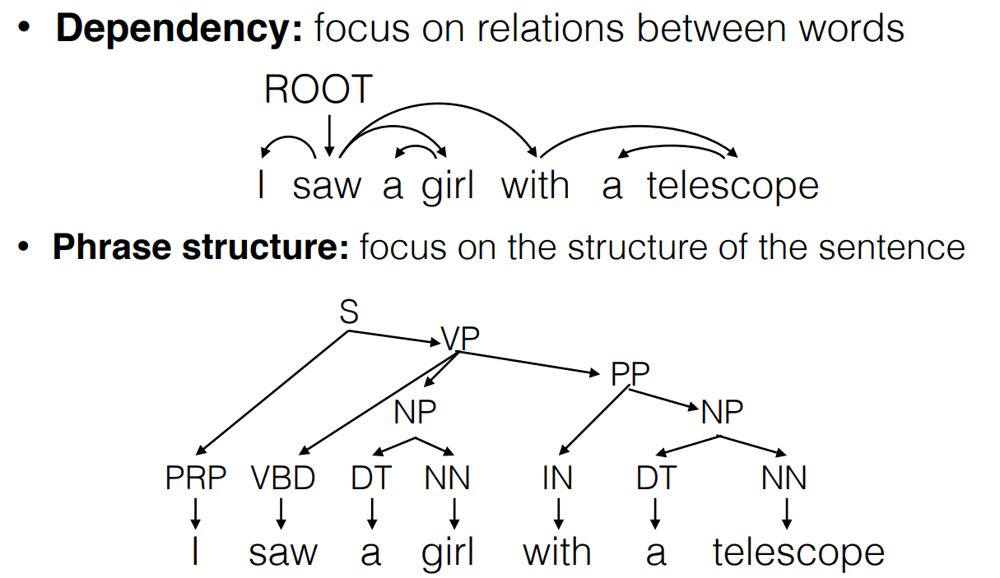

# Transition-based Parsing with Neural Nets

**两种语言模型**

* Dependency : focus on relations between words, 常用在 semantic 任务中
* Phrase structure : focus on the structure of the sentence, 常用在 syntactic 任务中

## Parsing

> predicting linguistic structure from input sentence

**transition-based models**

* step through one by one until we have output
* like history-based model for part-of-speech tagging

**graph-based models**

* like linear CRF model for part-of-speech tagging

**为什么要考虑 Dependencies**

> 在语义任务上，dependencies 往往表现的更好，因为，有关系的 word 往往在 tree 中离的也比较近
>
> 可以将 dependencies 打上标签。
>
> 