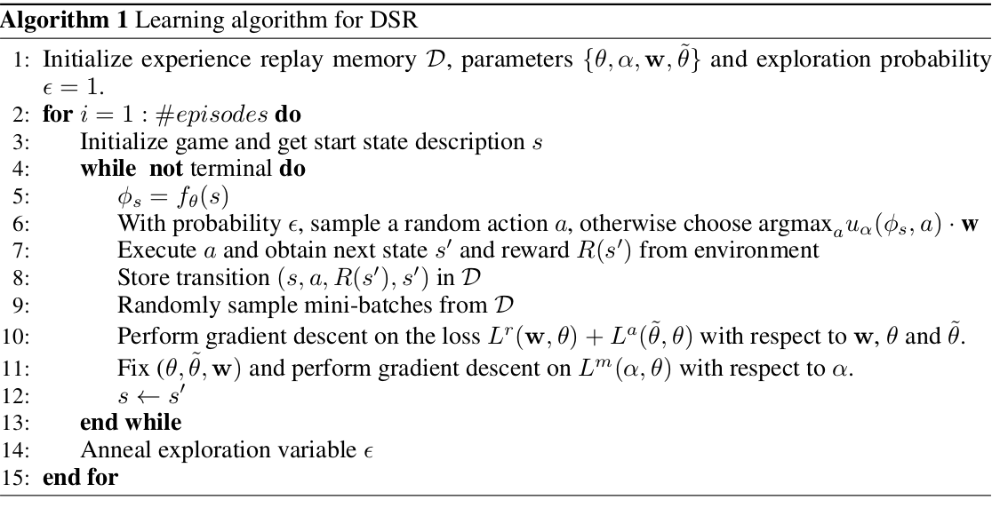

# Hierarchical Learning

## Deep Successor Reinforcement Learning

> Learning robust value functions given raw observations and rewards is now possible with model-free and model-based deep reinforcement learning algorithms. There is a third alternative, called Successor Representations(SR).

* model-free
* model-based
* successor representation

> Successor Representation which decomposes the value function into two components:
>
> * a reward predictor
> * a successor map
>   * represent the **expected future state occupancy from any given state** and the **reward predictor maps states to scalar rewards**. 
>
> The value function can be computed as the **inner product between the successor map** and the **reward weights**.

这里需要注意的是：是 reward predictor， 这个模型的意思是打算搞 reward 了

> The value function at a state can be expressed as the dot product between the **vector of expected discounted future state occupancies** and the **immediate reward** in each of those successor states.

**Introduction**

SR's appealing properties:

* combine computational efficiency comparable to model-free algorithms with some of the flexibility of model-based algorithms   ??????
* SR can adapt quickly to changes in distal reward, unlike model-free algorithms ?????

**关于这篇文章的问题：**

* $m_{sa}\cdot \mathbf w$ 用来表示 $Q(s,a)$ , $\phi_s\cdot \mathbf w$ 来表示 $R(s)$ , 至少也得是表示  $R(s,a)$ 吧！！！！

$$
Q^\pi(s,a) = \sum_{s'\in S}M(s,s',a)R(s') \tag1
$$

* 感觉 (1) 式是有问题的，MDP 的reward 是 $R(s,a)$ 啊，咋就变成了 $R(s)$

* 用 $R(s,a)$ 来表示 $R(s')$ ??????

## Hierarchical Deep RL: Integrating Temporal Abstraction and Intrinsic Motivation

**abstract**

> Learning goal-directed behavior in environment with sparse feedback is a major challenge for reinforcement learning algorithms.
>
> The primary difficulty arises due to **insufficient exploration**, result in an agent being unable to learn **robust value functions**.
>
> **Intrinsic motivated** agents can explore new behavior for its own sake rather than to directly solve problems.
>
> hierarchical-DQN, a framework to integrate 
>
> * hierarchical value functions, operating at different time-scales, 
> * with intrinsically motivated deep reinforcement learning.
>
> 
>
> * a Top-level value function learns a policy over intrinsic goals, and
> * a lower-level function learns a policy over atomic actions to satisfy the given goals
>
> 适用环境：
>
> * vary sparse, delayed feedback

**Introduction**

> we propose  a framework that integrates 
>
> * deep reinforcement learning with 
> * hierarchical value functions.
>
> where the agent is motivated to solve intrinsic goals (via learning options) to aid exploration.

## Questions

* ​

## Glossary

* state occupancy
* enable exploration at different time-scales
* goal-directed behavior 
* multiple-level spatial-temporal abstraction 