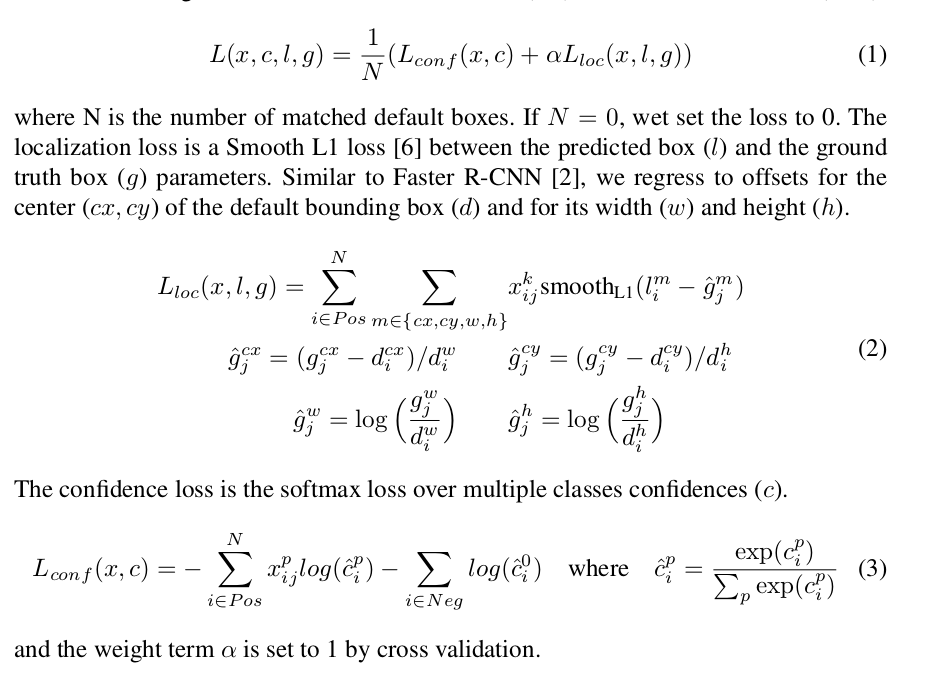

# RCNNs


## Faster Rcnn

### region Proposal networks

* 输入： 任意大小的图片
* 输出：长方形 的 `object proposal` 和 是否为目标的低分（是目标，还是背景）


**RPN的loss**
$$
L\Bigr(\{p_i\}, \{t_i\}\Bigr)=\frac{1}{N_{cls}}\sum_iL_{cls}(p_i,p^*_i)+\lambda\frac{1}{N_{reg}}\sum_ip^*_iL_{reg}(t_i,t_i^*)
$$

* $i$ 表示 mini-batch中的第 $i$ 个 $anchor$
* $p_i$ 是预测 第 $i$ 个anchor 是 目标的概率。（目标 or 背景）
* $p_i^*$ 是 `ground truth` `label`， 如果 anchor $i$ 是 positive 的，就为1。 如果 anchor $i$  是 negative 的，就为 0。
* $t_i^*$  是 `ground truth bounding box`，这个 `bounding box` 是于当前 `anchor` 相关的
* 所以， `bounding box regression` 可以看作， 用 `anchor` 来预测离它最近的 `grounding truth bounding box`


**将anchor标注为positive的准则是：**

* 对于某个 `ground truth bounding box` ，此 `anchor` 具有最高的 `IOU`
* 某个 `anchor` 对 与任何 `grounding box` 都具有大于 `0.7` 的 `IOU`
* 注意：一个 `ground-truth bounding box` 可能会 指定 多个 `anchor` 为 `positive`

**将anchor标注为negative的准则是：**

* 如果某个 `anchor` 对所有的 `grounding-truth bounding box` 都低于 `0.3` 的 `IOU`， 就把它指定为 `negative`

如果一个`anchor`既不是 `positive`，也不是`negative`的话， 就把它给扔了。


**总结：**

* `anchor`  只是概念上的一个东西，假设那个地方有一个anchor，然后判断这个anchor是positive还是negative的，或者既不是positive也不是negative。
* `anchor` 负责预测离它最近的一个 bounding-box


## Fast R-CNN


**ROI pooling:**

* AN roi is a rectangular window into a conv feature map.
* 每个`roi` 由一个四元组定义 `(r,c,h,w)` 指定了 `top-left` 点 `r,c` 和  高宽`h,w`
* Roi max pooling 将 $h*w$ 的 roi window ， 划分成 $H*W$ 的网格，每个网格的大小大约是 $\frac{h}{H}, \frac{w}{W}$， 然后对每个网格中的值进行`max pooling`。 
* 问题是：怎么得到  roi window，region of interest， 通过selective search 得到的？？？


**用 VGG16 来举例：**


* $H=7, W=7$，意味着把 roi 分为 49 个网格，记住每个 roi 由一个四元组定义。


* VGG16 的最后一层1000类分类层被换成 两个兄弟层，一个用来 $K+1$ 的分类，+1 是因为背景，一个用来预测 bounding-box， 每个类都对应一个bounding box，共 $4K$ 个输出。预测 roi 的 bounding-box ?
* 网络被修改成两个输入：a list of images and a list of ROIs in those images。一个图片可能对应多个 `roi`？


**关于训练loss：**

* 两个 sibling 输出层。
* 一个是分类 $K+1$ 类
* 另一个是 bounding-box regression offsets，$t^k=\Bigr(t_x^k,t_y^k,t_w^l,t_h^k\Bigr)$，$t^k$ 指定了一个scale-invariant translation 和 log-space 中的 相对于 proposal 的相对偏移$h,w$。
* 每个训练的 ROI 都会被打上标签，一个是 ground-truth 类标签，一个是 ground-truth bounding-box 回归目标 $v$。

**思考：**

* 先用 region proposal 找到 ROI，然后通过 ROI 计算好 bounding box，然后预测
* 手工费不少吧，毕竟这么麻烦


## SPP net

> 已经存在的网络都需要固定的 大小 （224×224）。这种需求非常“人工”，而且对于任意大小的图片，可能会降低认知能力。所以这篇文章文章提出了一个 "spatial pyramid pooling" 用来解决以上问题。使用 "SPP 层"，任意大小的图像都会生成一个固定长度的表示。

怎么玩的呢？ 

和传统pooling 层的区别？

* 传统pooling层，kernel大小固定，spp 层，输出feature map 的大小固定


训练与测试：

* `Spp net` 在训练的时候，只是提供了两个输入大小
* 在test的时候，可以根据 输入图片的大小来调整 SPP net的大小。


## R-CNN

开篇之作：


* solve the CNN localization problem by operating within the **"recognition using regions"** paradigm


**三个模块：**

* category-independent region proposals
  * 使用 selective-search 算法来生成，category-independent region proposals
* CNN , 用于提取 region 的特征
  * 从每个 region proposals 中提取 4096 维的特征。
  * 为了CNN可以计算 region proposals 的 4096维的特征，直接将 region proposals warp成 227×227大小（用的 ALEX-net）
  * **warp:** 将紧致 bbox中的像素在 warp之前，首先扩大了原来的紧致bbox
* SVM 分类器，用来分类 region 类别


**基本流程：**

1.  region proposal
2.  warp 成统一大小
3.  用 CNN 提取 ROI 的特征
4.  把提取出来的特征做分类。（分类的方法可以有很多咯）


**预训练与微调 CNN 的方法：**

因为需要用 CNN 进行特征提取，然后进行分类，所以，预训练 CNN 是有必要的，需要保证可以提取到一个好的特征，然后用来分类或干其他。

* Pre train，使用 ImageNet 数据集进行 预训练
* 微调：使用 warped 的 region 进行微调
  * 微调如何打标签：IoU 大于0.5 的当作正例，其它的作为反例。
  * 正例就是类别， 反例就是背景吧。
  * 微调的时候，2000个框中，从正例 proposal中 均匀采32个，从负例 proposal中，采96个，128个样本组成 mini-batch。


**测试时候是怎么玩的：**

* 用 selective search 提取2000个 region proposals
* warp 每个 proposal  然后放入 CNN 提取特征。
* 对特征用 SVM 分类
* 如果两个 proposal region 有很高的 IOU，那就取，分类得分最高的那个？是这么理解么


**第一次阅读留下的问题：**

* 如何 `warp` region 中 的图像？
* 对于 正例采32,负例采96的解释有疑问！！！
* tight bounding box 指的啥。

> Prior to warping, dilate the tight bounding box, make p pixels around the original
>
> 解释： $ratio=\frac{w_{proposal}}{227-2p}$,  将原图按此比例进行变换，然后以 proposal 的中心为中心点，截取227大小的图片作为输入。如果 $w_{proposal}$ 比 $227-2p$ 小， 那么原图要扩张一下，然后再从扩张的原图切，为什么要搞成这样撒？


## NMS (Non-Maximum Suppression)

[代码来自](http://www.pyimagesearch.com/2014/11/17/non-maximum-suppression-object-detection-python/)

```python
#  Felzenszwalb et al.
def non_max_suppression_slow(boxes, overlapThresh):
	# if there are no boxes, return an empty list
	if len(boxes) == 0:
		return []
 
	# 保存的 bbox 放在这个list中。
	pick = []
 
	# 获取各个 bbox 的坐标
	x1 = boxes[:,0]
	y1 = boxes[:,1]
	x2 = boxes[:,2]
	y2 = boxes[:,3]
 
	# 计算 bbox 的区域面积 ，通过右下角的 y 坐标对 bbox 排序。小 --> 大，为什么右下角的y坐标？？
	area = (x2 - x1 + 1) * (y2 - y1 + 1)
	idxs = np.argsort(y2)
    
    # keep looping while some indexes still remain in the indexes
	# list
    # 对 idxs 逆序读取。
	while len(idxs) > 0:
		# grab the last index in the indexes list, add the index
		# value to the list of picked indexes, then initialize
		# the suppression list (i.e. indexes that will be deleted)
		# using the last index
		last = len(idxs) - 1
		i = idxs[last]
		pick.append(i)
		suppress = [last] # 准备从 idxs 中删掉这个，因为它已经被添加到 pick 中去了。
        
        # 遍历 idxs 中的所有 indexes， 计算 重叠 ratio 来确定 扔掉那些 bbox。
		for pos in range(0, last):
			# grab the current index
			j = idxs[pos]
 
            # i 是右下角 y 轴坐标 最远的bbox 的索引。
            # j 是 idxs 中的顺序索引
            # 获得的是 两个 bbox 的 重叠区域
			xx1 = max(x1[i], x1[j])
			yy1 = max(y1[i], y1[j])
			xx2 = min(x2[i], x2[j])
			yy2 = min(y2[i], y2[j])
 
			# 计算两个 bbox 重叠区域的 w，h
			w = max(0, xx2 - xx1 + 1)
			h = max(0, yy2 - yy1 + 1)
 
			# 计算 重叠区域 和 j bbox 的 重叠ratio
			overlap = float(w * h) / area[j]
 
			# 如果重叠 ratio 超过了某个值，说明 i bbox 有能力代表 j，
    		# j 就可以丢弃了。
			if overlap > overlapThresh:
				suppress.append(pos)
 
		# 将该丢弃的 bbox 的 索引从 idxs 中删除。
		idxs = np.delete(idxs, suppress)
 
	# 返回 picked 的 bbox
	return boxes[pick]
```


[代码来自](https://www.pyimagesearch.com/2015/02/16/faster-non-maximum-suppression-python/)

```python
# 思想和上面的代码一样，更充分的利用了 array 计算。
# import the necessary packages
import numpy as np
 
# Malisiewicz et al.
def non_max_suppression_fast(boxes, overlapThresh):
	# if there are no boxes, return an empty list
	if len(boxes) == 0:
		return []
 
	# if the bounding boxes integers, convert them to floats --
	# this is important since we'll be doing a bunch of divisions
	if boxes.dtype.kind == "i":
		boxes = boxes.astype("float")
 
	# initialize the list of picked indexes	
	pick = []
 
	# grab the coordinates of the bounding boxes
	x1 = boxes[:,0]
	y1 = boxes[:,1]
	x2 = boxes[:,2]
	y2 = boxes[:,3]
 
	# compute the area of the bounding boxes and sort the bounding
	# boxes by the bottom-right y-coordinate of the bounding box
	area = (x2 - x1 + 1) * (y2 - y1 + 1)
	idxs = np.argsort(y2)
 
	# keep looping while some indexes still remain in the indexes
	# list
	while len(idxs) > 0:
		# grab the last index in the indexes list and add the
		# index value to the list of picked indexes
		last = len(idxs) - 1
		i = idxs[last]
		pick.append(i)
 
		# find the largest (x, y) coordinates for the start of
		# the bounding box and the smallest (x, y) coordinates
		# for the end of the bounding box
		xx1 = np.maximum(x1[i], x1[idxs[:last]])
		yy1 = np.maximum(y1[i], y1[idxs[:last]])
		xx2 = np.minimum(x2[i], x2[idxs[:last]])
		yy2 = np.minimum(y2[i], y2[idxs[:last]])
 
		# compute the width and height of the bounding box
		w = np.maximum(0, xx2 - xx1 + 1)
		h = np.maximum(0, yy2 - yy1 + 1)
 
		# compute the ratio of overlap
		overlap = (w * h) / area[idxs[:last]]
 
		# delete all indexes from the index list that have
		idxs = np.delete(idxs, np.concatenate(([last],
			np.where(overlap > overlapThresh)[0])))
 
	# return only the bounding boxes that were picked using the
	# integer data type
	return boxes[pick].astype("int")
```


## SSD

> single shot MultiBox Detector

Our approach, named SSD, discretizes the output space of bounding boxes into a set of default boxes over different aspect ratios and scales per feature map location.


At prediction time, the network generates scores for the presence of each object category in each default box and produces adjustments to the box to better match the object shape.


Our improvements include using a small convolutional filter to predict object categories and offsets in bounding box locations, using separate predictors (filters) for different aspect ratio detections, and applying these filters to multiple feature maps from the later stages of a network in order to perform detection at multiple scales.


**The core of SSD is predicting category scores and box offsets for a fixed set of default bounding boxes using small convolutional filters applied to feature maps.**


>  The SSD approach is based on a feed-forward convolutional network that produces a fixed-size collection of bounding boxes and scores for the presence of object class instances in those boxes 

* 前向卷积网络 生成一个 固定大小的集合，集合中包含 bbox 和 这些 bbox 的分类概率


> We associate a set of default bounding boxes with each feature map cell, for multiple feature maps at the top of the network. The default boxes tile the feature map in a convolutional manner, so that the position of each box relative to its corresponding cell is fixed.

将 default bbox 与 feature map cell 关联起来。


> At each feature map cell, we predict the offsets relative to the default box shapes in the cell, as well as the per-class scores that indicate the presence of a class instance in each of those boxes.


> During training we need to determine which default boxes correspond to a ground truth detection and train the network accordingly.

训练的时候，要确定 哪个 默认的 bbox 负责 ground truth bbox。如何确定呢？ 使用 jaccard overlap，如果 jaccard overlap 超过一个阈值， 那么就用那个默认的 bbox 来表示 ground truth bbox，这样的话，可以多个 默认的 bbox 来对应 一个 ground-truth bbox。

> jaccard overlap: 交集除以并集


$x_{ij}^p=\{0,1\}$  : i-th 默认的 bbox，j-th ground-truth bbox,   $p$ 类 

目标函数为：
$$
L(x,c,l,g)=\frac{1}{N}\Biggr(L_{conf}\Bigr(x,c\Bigr)+\alpha L_{loc}\Bigr(x,l,g\Bigr)\Biggr)
$$


> To handle different object scales, some methods [4,9] suggest processing the image at different sizes and combining the results afterwards.However, by utilizing feature maps from several different layers in a single network for prediction we can mimic the same effect, while also sharing parameters across all object scales


> Fortunately, within the SSD framework, the default boxes do not necessary need to correspond to the actual receptive fields of each layer. We design the tiling of default boxes so that **specific feature maps learn to be responsive to particular scales of the objects.** 

**几点疑问**

* 为什么不用左上角的点 而用 中心点
* $\hat{g}_j^{cx}$  不是一个 [0,1] 的值。


## 参考资料

[http://www.jianshu.com/p/deb0f69f5597](http://www.jianshu.com/p/deb0f69f5597)

