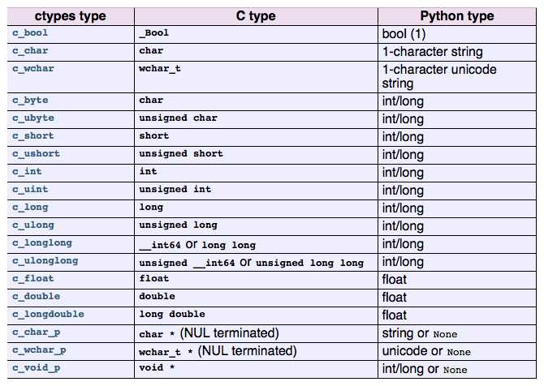

# python c语言扩展，使用 ctypes

众所周知，python 语言的执行效率是比较慢的，所以很多计算量大的的操作都是通过 python 调用 c 语言代码实现的。本篇博文将介绍如何 从 python 中访问 c 语言代码。


## 基本流程

* 编写 c 语言代码，并编译成 动态链接库

```shell
gcc -c -fpic example.c
gcc -shared example.o -o _example.so
```


* 在 python 中加载这个动态链接库已供使用

```python
import ctypes
import os
import sys

_file = '_example.so'
_path = os.path.join(sys.path[0], _file)
# 加载动态库
_mod = ctypes.cdll.LoadLibrary(_path)
```


## 要考虑的问题 

* python 与 c 的数据类型的转换
* 函数如何对应起来
* python 对象和 C 的哪个部分对应起来


**python特性**

* 多个返回值怎么搞
* ​


## python与C数据类型转换

因为涉及到了两个语言，所以涉及到不同语言之间类型 映射的问题， `ctypes` 采用 "中间类型" 的方式为 `python` 和 `C` 搭建起了桥梁。



> `ctypes.c_bool, .....` 在 `python` 中是个类。


**python 类型的值 到 ctype 类型的值**

```python
# 10 本来是 python.int, 经过这一句之后，就变成了 ctypes.c_int, 然后就可以给 C 函数了
val = ctypes.c_int(10)
```


**C类型的值 到 ctype 类型的值**

```python
# c_function() 返回的值本来是 C int, 但是通过包装之后，就变成了 ctypes.c_int, python中可以直接操作。
val = ctypes.c_int(_LIB.c_function())
```


**上面的列表中，仅仅罗列了一些 基本的数据类型，那么对于指针类型，应该怎么操作呢？**

```python
# 如果想要一个 int* 形式的中间类型。
# python 中是不包含指针这个概念的，只有 C 中才有指针这个概念，如果 C 的形参有个指针类型，应该怎么操作呢？
# 用 ctypes.POINTER() 创建一个指针类型。c_int_p 是一个崭新的类型
c_int_p = ctypes.POINTER(ctypes.c_int) 
```


**如何操作数组呢？？？？**

```python
# 如何创建一个 ctypes 的中间类型用来表示数组
array=ctypes.c_double * len(param)

# 如何给这个数组赋值
val = array(*list_val), # 这个传给 C 就可以操作了。
```


**int 类型** `int ---> ctypes.c_int`

```c
// c语言代码
int add(int x, int y){
  return x+y;
}
```

```python
# python 代码
import ctypes
import os
import sys

_file = '_example.so'
_path = os.path.join(sys.path[0], _file)
_mod = ctypes.cdll.LoadLibrary(_path)

# int add(int, int), 注意一个是 argtypes, 一个是 restype，这也表示了 c 语言只能返回一个值的特点
add = _mod.add
add.argtypes = (ctypes.c_int, ctypes.c_int)
add.restype = ctypes.c_int

# 调用
print (add(3, 10))
```


**double类型** `double ---> ctypes.c_double`


**指针类型** `int* ---> ctype.POINTER(ctypes.c_int)`

```c
// c 语言代码
int divide(int a, int b, int * remainder){
  int quot = a / b;
  *remainder = a % b;
  return quot;
}
```

```python
# load dll 
_divide = _mod.divide
_divide.argtypes = (ctypes.c_int, ctypes.c_int, ctypes.POINTER(ctypes.c_int))
_divide.restype = ctypes.c_int
# 这也是返回多个值的一个例子
def divide(x, y):
    rem = ctypes.c_int()
    # 对于设计指针的参数，必须创建一个兼容的 ctypes 对象
    quot = _divide(x,y, rem)
    return quot, rem.value # 记得加个 value
```


**C语言 数组到 python 的对应**

```c
// c 语言代码，数组的平均值
double avg(double* a, int n){
  int i;
  double total = 0.0;
  for (i=0;i<n;i++)
    total += a[i];
  return total / n;
}
```

```python
# 需要一个 python 类来处理 python 中的数组，传给C语言代码
class DoubleArrayType(object):
    # 可以看出 from_param 是一个默认掉用的入口
    def from_param(self, param):
        typename = type(param).__name__
        if hasattr(self, 'from_' + typename):
            return getattr(self, 'from_' + typename)(param)
        elif isinstance(param, ctypes.Array):
            return param
        else:
            raise ValueError('Type Error')

    def from_list(self, param):
        # ctypes.c_double * len(param) 创建了个新的类，然后实例化了一个对象
        val = ((ctypes.c_double * len(param))(*param))
        return val

    from_tuple = from_list

    def from_ndarray(self, param):
        return param.ctypes.data_as(ctypes.POINTER(ctypes.c_double))

# 这里是个对象，而不是刚才创建的类，
# 可以看出，对象仅是用来对 输入数据进行处理，然后送给 C语言部分的
# DoubleArray 只是为了调用 from_param
DoubleArray = DoubleArrayType()
_avg = _mod.avg
_avg.argtypes = (DoubleArray, ctypes.c_int)
_avg.restype = ctypes.c_double


def avg(values):
    print(_avg(values, len(values)))
    # 大胆猜测一下， _avg(values, len(values)) 的执行
    # 首先：会 DoubleArray.from_param(values)
    # 然后：返回的值给 C。


avg([1., 2., 3.])
```


**C中的结构体如何与Python对应**

```c
// C 语言代码，有个结构体，有个操作结构体的函数
typedef struct{
    double x,y;
} Point;

double distance(Point* p1, Point* p2){
    return (p1->x-p2->x)*(p1->y-p2->y);
}
```

```python
# 创建个 类，与 C 中的结构体 对应起来
# _fields_ 是一个下划线
class Point(ctypes.Structure):
    _fields_ = [('x', ctypes.c_double),
                  ('y', ctypes.c_double)]


distance = _mod.distance
distance.argtypes = (ctypes.POINTER(Point), ctypes.POINTER(Point))
distance.restype = ctypes.c_double

res = distance(Point(1, 2), Point(2, 3))

print(res)
```


* **指定 argtypes 和 restype 只是为了 python 在传入C 代码时对参数进行一下预处理，当然也可以不指定 argtypes 和 restype**


**ctypes 实现了一系列的类型转换方法，Python的数据类型会包装或直接推算为C类型，作为函数的调用参数；函数的返回值也经过一系列的包装成为Python类型。也就是说，PyObject* <-> C types的转换是由ctypes内部完成的。**


## 参考资料

[http://www.cnblogs.com/wuchang/archive/2010/04/04/1704456.html](http://www.cnblogs.com/wuchang/archive/2010/04/04/1704456.html)

[https://zhuanlan.zhihu.com/p/23372572](https://zhuanlan.zhihu.com/p/23372572)

[https://www.zhihu.com/question/23003213](https://www.zhihu.com/question/23003213)

[https://zhuanlan.zhihu.com/python-dev/20152309](https://zhuanlan.zhihu.com/python-dev/20152309)

